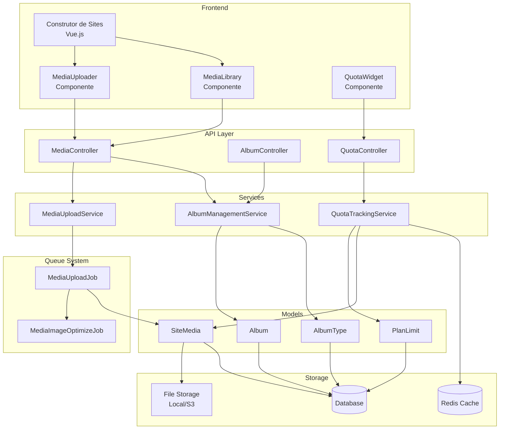
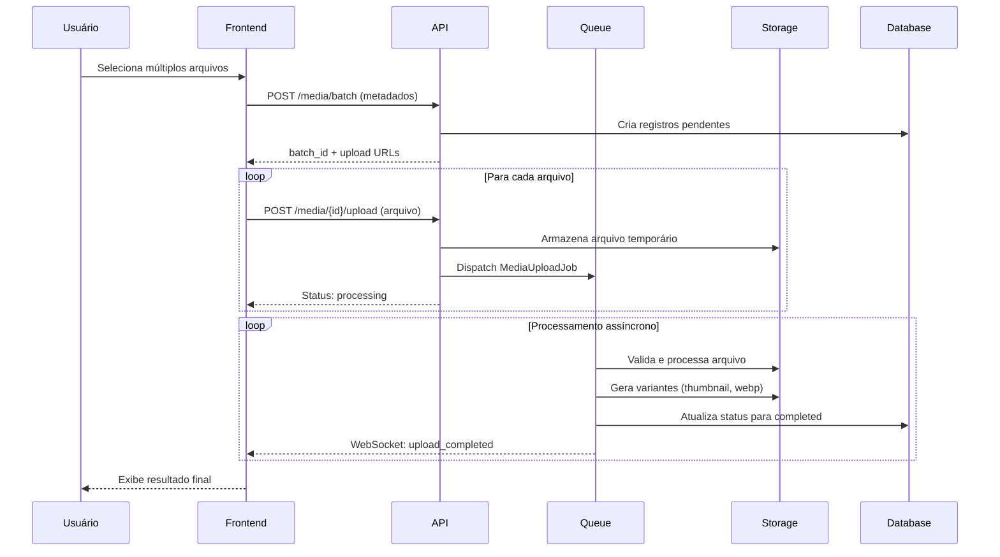
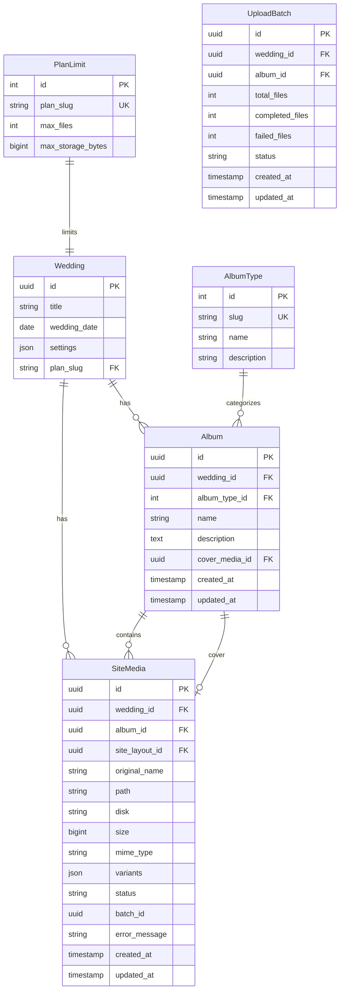

# Documento de Design

## Visão Geral

O Módulo de Gerenciamento de Mídia é uma extensão do sistema existente de upload de mídia da plataforma de casamentos. Este design expande o modelo `SiteMedia` e o serviço `MediaUploadService` existentes para suportar organização em álbuns, upload assíncrono de múltiplos arquivos, controle de cotas por plano de assinatura e integração aprimorada com o construtor de sites.

A arquitetura segue os padrões já estabelecidos no projeto Laravel/Filament, utilizando:
- Jobs do Laravel para processamento assíncrono
- Filament para interface administrativa
- Vue.js para componentes do construtor de sites
- SystemConfig para parâmetros configuráveis

## Arquitetura



### Fluxo de Upload Assíncrono



## Componentes e Interfaces

### Backend (PHP/Laravel)

#### Models

```php
// app/Models/AlbumType.php
class AlbumType extends Model
{
    const PRE_WEDDING = 'pre_casamento';
    const POST_WEDDING = 'pos_casamento';
    const SITE_USAGE = 'uso_site';
    
    protected $fillable = ['slug', 'name', 'description'];
    
    public function albums(): HasMany;
}

// app/Models/Album.php
class Album extends Model
{
    use HasUuids;
    
    protected $fillable = [
        'wedding_id',
        'album_type_id', 
        'name',
        'description',
        'cover_media_id'
    ];
    
    public function wedding(): BelongsTo;
    public function albumType(): BelongsTo;
    public function media(): HasMany;
    public function coverMedia(): BelongsTo;
}

// app/Models/SiteMedia.php (extensão)
class SiteMedia extends Model
{
    protected $fillable = [
        // campos existentes...
        'album_id',        // novo
        'status',          // novo: pending, processing, completed, failed
        'batch_id',        // novo: para uploads em lote
        'error_message',   // novo: mensagem de erro se falhou
    ];
    
    public function album(): BelongsTo;
}

// app/Models/PlanLimit.php
class PlanLimit extends Model
{
    protected $fillable = [
        'plan_slug',           // 'basic', 'premium'
        'max_files',           // número máximo de arquivos
        'max_storage_bytes',   // espaço máximo em bytes
    ];
}
```

#### Services

```php
// app/Services/Media/AlbumManagementService.php
interface AlbumManagementServiceInterface
{
    public function createAlbum(Wedding $wedding, string $typeSlug, array $data): Album;
    public function updateAlbum(Album $album, array $data): Album;
    public function deleteAlbum(Album $album, ?Album $moveToAlbum = null): bool;
    public function moveMedia(SiteMedia $media, Album $targetAlbum): SiteMedia;
    public function getAlbumsByType(Wedding $wedding): Collection;
}

// app/Services/Media/QuotaTrackingService.php
interface QuotaTrackingServiceInterface
{
    public function getUsage(Wedding $wedding): QuotaUsage;
    public function canUpload(Wedding $wedding, int $fileSize, int $fileCount = 1): QuotaCheckResult;
    public function getPlanLimits(Wedding $wedding): PlanLimit;
    public function getUsagePercentage(Wedding $wedding): array;
}

// app/Services/Media/BatchUploadService.php
interface BatchUploadServiceInterface
{
    public function createBatch(Wedding $wedding, Album $album, array $fileMetadata): UploadBatch;
    public function processFile(UploadBatch $batch, string $mediaId, UploadedFile $file): void;
    public function cancelBatch(UploadBatch $batch): void;
    public function getBatchStatus(UploadBatch $batch): BatchStatus;
}
```

#### Jobs

```php
// app/Jobs/ProcessMediaUpload.php
class ProcessMediaUpload implements ShouldQueue
{
    use Dispatchable, InteractsWithQueue, Queueable, SerializesModels;
    
    public function __construct(
        public SiteMedia $media,
        public string $tempPath
    ) {}
    
    public function handle(MediaUploadService $service): void;
    public function failed(\Throwable $exception): void;
}

// app/Jobs/OptimizeMediaImage.php
class OptimizeMediaImage implements ShouldQueue
{
    public function __construct(public SiteMedia $media) {}
    public function handle(MediaUploadService $service): void;
}
```

#### Controllers

```php
// app/Http/Controllers/Api/MediaController.php
class MediaController extends Controller
{
    public function createBatch(CreateBatchRequest $request): JsonResponse;
    public function uploadFile(string $mediaId, UploadFileRequest $request): JsonResponse;
    public function cancelUpload(string $mediaId): JsonResponse;
    public function index(MediaIndexRequest $request): JsonResponse;
    public function show(string $mediaId): JsonResponse;
    public function destroy(string $mediaId): JsonResponse;
    public function batchDestroy(BatchDestroyRequest $request): JsonResponse;
    public function move(string $mediaId, MoveMediaRequest $request): JsonResponse;
}

// app/Http/Controllers/Api/AlbumController.php
class AlbumController extends Controller
{
    public function index(Wedding $wedding): JsonResponse;
    public function store(CreateAlbumRequest $request): JsonResponse;
    public function update(Album $album, UpdateAlbumRequest $request): JsonResponse;
    public function destroy(Album $album, DeleteAlbumRequest $request): JsonResponse;
}

// app/Http/Controllers/Api/QuotaController.php
class QuotaController extends Controller
{
    public function show(Wedding $wedding): JsonResponse;
    public function checkUpload(CheckUploadRequest $request): JsonResponse;
}
```

### Frontend (Vue.js)

#### Componentes

```typescript
// resources/js/Components/Site/MediaLibrary.vue
interface MediaLibraryProps {
    weddingId: string;
    selectionMode: 'single' | 'multiple';
    filterByAlbumType?: string;
    onSelect: (media: SiteMedia | SiteMedia[]) => void;
}

// resources/js/Components/Site/BatchUploader.vue
interface BatchUploaderProps {
    weddingId: string;
    albumId?: string;
    maxFiles?: number;
    onBatchComplete: (results: UploadResult[]) => void;
    onProgress: (progress: BatchProgress) => void;
}

// resources/js/Components/Site/AlbumSelector.vue
interface AlbumSelectorProps {
    weddingId: string;
    selectedAlbumId?: string;
    allowCreate: boolean;
    onSelect: (album: Album) => void;
}

// resources/js/Components/Dashboard/QuotaWidget.vue
interface QuotaWidgetProps {
    weddingId: string;
    showUpgradePrompt: boolean;
}
```

### Configurações Administrativas (SystemConfig)

```php
// Chaves de configuração no SystemConfig
'media.max_image_width' => 4096,           // pixels
'media.max_image_height' => 4096,          // pixels
'media.max_image_size' => 10485760,        // 10MB em bytes
'media.max_video_size' => 104857600,       // 100MB em bytes
'media.allowed_extensions' => ['jpg', 'jpeg', 'png', 'gif', 'webp', 'mp4', 'webm'],

// Limites por plano (PlanLimit model)
'basic' => ['max_files' => 100, 'max_storage_bytes' => 524288000],    // 500MB
'premium' => ['max_files' => 1000, 'max_storage_bytes' => 5368709120], // 5GB
```

## Modelos de Dados

### Diagrama ER



### DTOs e Value Objects

```php
// app/DTOs/QuotaUsage.php
class QuotaUsage
{
    public function __construct(
        public int $currentFiles,
        public int $maxFiles,
        public int $currentStorageBytes,
        public int $maxStorageBytes,
        public float $filesPercentage,
        public float $storagePercentage,
    ) {}
    
    public function isAtLimit(): bool;
    public function isNearLimit(float $threshold = 0.8): bool;
}

// app/DTOs/QuotaCheckResult.php
class QuotaCheckResult
{
    public function __construct(
        public bool $canUpload,
        public ?string $reason = null,
        public ?string $upgradeMessage = null,
    ) {}
}

// app/DTOs/BatchStatus.php
class BatchStatus
{
    public function __construct(
        public string $batchId,
        public int $total,
        public int $completed,
        public int $failed,
        public int $pending,
        public array $errors,
    ) {}
    
    public function isComplete(): bool;
    public function getProgressPercentage(): float;
}

// app/DTOs/UploadResult.php
class UploadResult
{
    public function __construct(
        public string $mediaId,
        public bool $success,
        public ?SiteMedia $media = null,
        public ?string $error = null,
    ) {}
}
```


## Propriedades de Corretude

*Uma propriedade é uma característica ou comportamento que deve ser verdadeiro em todas as execuções válidas de um sistema - essencialmente, uma declaração formal sobre o que o sistema deve fazer. Propriedades servem como ponte entre especificações legíveis por humanos e garantias de corretude verificáveis por máquina.*

### Propriedade 1: Criação de Batch Cria Entradas Corretas

*Para qualquer* lista de N metadados de arquivos submetida para criação de batch, o sistema deve criar exatamente N registros de SiteMedia com status "pending" e o mesmo batch_id.

**Valida: Requisitos 1.1**

### Propriedade 2: Falhas Isoladas Não Afetam Outros Uploads

*Para qualquer* batch contendo arquivos válidos e inválidos, o processamento de arquivos válidos deve ser concluído com sucesso independentemente das falhas dos arquivos inválidos.

**Valida: Requisitos 1.4**

### Propriedade 3: Resumo de Batch Contém Contagens Corretas

*Para qualquer* batch processado, o BatchStatus retornado deve ter `completed + failed + pending = total`, e as contagens devem corresponder aos status reais dos registros de SiteMedia.

**Valida: Requisitos 1.5**

### Propriedade 4: Integridade Referencial de Álbum e Mídia

*Para qualquer* tentativa de criar álbum sem album_type_id válido, a operação deve falhar. *Para qualquer* tentativa de criar mídia sem album_id válido, a operação deve falhar. *Para qualquer* criação com referências válidas, a operação deve suceder.

**Valida: Requisitos 2.2, 2.3**

### Propriedade 5: Agrupamento de Álbuns por Tipo

*Para qualquer* wedding com álbuns de múltiplos tipos, a função getAlbumsByType deve retornar uma coleção onde todos os álbuns estão agrupados por seu album_type_id, e cada grupo contém apenas álbuns daquele tipo.

**Valida: Requisitos 2.4**

### Propriedade 6: Mover Mídia Preserva Arquivo Único

*Para qualquer* operação de mover mídia de álbum A para álbum B, após a operação: (1) o album_id da mídia deve ser B, (2) o path do arquivo deve permanecer inalterado, (3) o arquivo físico deve existir apenas uma vez no storage.

**Valida: Requisitos 2.5, 8.4**

### Propriedade 7: Redimensionamento Automático de Imagens Grandes

*Para qualquer* imagem com dimensões maiores que max_image_width ou max_image_height configurados, após processamento, as dimensões da imagem armazenada devem ser menores ou iguais aos limites configurados, mantendo a proporção original.

**Valida: Requisitos 3.4**

### Propriedade 8: Rejeição de Arquivos Acima do Limite

*Para qualquer* arquivo de imagem com tamanho maior que max_image_size, ou arquivo de vídeo com tamanho maior que max_video_size, o upload deve ser rejeitado com erro descritivo antes do armazenamento.

**Valida: Requisitos 3.5**

### Propriedade 9: Verificação de Cota Bloqueia Uploads

*Para qualquer* wedding que atingiu max_files ou max_storage_bytes do seu plano, tentativas de upload devem retornar QuotaCheckResult com canUpload=false e reason explicativo.

**Valida: Requisitos 4.3, 4.4**

### Propriedade 10: Upgrade de Plano Aplica Novos Limites

*Para qualquer* wedding que faz upgrade de plano básico para premium, imediatamente após o upgrade, canUpload deve retornar true para uploads que antes eram bloqueados por limite do plano básico (assumindo que não excedem limites premium).

**Valida: Requisitos 4.6**

### Propriedade 11: Cálculo Correto de Uso de Cota

*Para qualquer* wedding, QuotaUsage.currentFiles deve ser igual à contagem de SiteMedia com status "completed" para aquele wedding, e QuotaUsage.currentStorageBytes deve ser igual à soma dos campos size desses registros.

**Valida: Requisitos 5.1, 5.5, 5.6**

### Propriedade 12: Alerta de Cota em 80%

*Para qualquer* QuotaUsage onde filesPercentage >= 80% ou storagePercentage >= 80%, o método isNearLimit(0.8) deve retornar true.

**Valida: Requisitos 5.3**

### Propriedade 13: Oferta de Upgrade para Plano Básico em 100%

*Para qualquer* wedding com plano básico onde QuotaUsage.isAtLimit() retorna true, QuotaCheckResult deve incluir upgradeMessage não-nulo.

**Valida: Requisitos 5.4**

### Propriedade 14: Filtragem de Mídia por Álbum e Tipo

*Para qualquer* consulta de mídia com filtro de album_id ou album_type_id, todos os resultados retornados devem pertencer ao álbum especificado ou a álbuns do tipo especificado.

**Valida: Requisitos 6.2, 8.6**

### Propriedade 15: URL Otimizada Retornada para Mídia

*Para qualquer* SiteMedia com variantes geradas, getVariantUrl('webp') deve retornar URL válida se variante webp existe, e getUrl() deve retornar URL do arquivo original.

**Valida: Requisitos 6.5**

### Propriedade 16: Validação de Arquivo Rejeita Inválidos

*Para qualquer* arquivo onde: (1) MIME type não corresponde à extensão, ou (2) extensão não está na lista permitida, ou (3) contém assinaturas maliciosas conhecidas, validateFile deve retornar ValidationResult com isValid()=false.

**Valida: Requisitos 7.1, 7.2, 7.3, 7.4**

### Propriedade 17: Geração de Variantes para Imagens

*Para qualquer* imagem processada com sucesso, o campo variants deve conter pelo menos as chaves 'thumbnail' e 'webp', e os arquivos correspondentes devem existir no storage.

**Valida: Requisitos 7.5**

### Propriedade 18: Nomes UUID para Arquivos

*Para qualquer* SiteMedia criado, o campo path deve conter um nome de arquivo que é um UUID válido (formato: 8-4-4-4-12 caracteres hexadecimais) seguido da extensão original.

**Valida: Requisitos 7.6**

### Propriedade 19: Exclusão Remove Arquivo e Variantes

*Para qualquer* SiteMedia excluído, após a operação delete(): (1) o arquivo em path não deve existir no storage, (2) todos os arquivos em variants não devem existir no storage, (3) o registro não deve existir no banco de dados.

**Valida: Requisitos 8.3**

### Propriedade 20: Operações em Lote Afetam Todos os Itens

*Para qualquer* lista de N IDs de mídia submetida para operação em lote (excluir ou mover), após a operação, exatamente N registros devem ter sido afetados (excluídos ou movidos).

**Valida: Requisitos 8.5**

### Propriedade 21: Busca Filtra Corretamente

*Para qualquer* consulta de busca com filtros de nome, mime_type e album_id, todos os resultados retornados devem satisfazer todos os filtros especificados simultaneamente.

**Valida: Requisitos 8.6**

## Tratamento de Erros

### Erros de Upload

| Código | Mensagem | Causa | Ação |
|--------|----------|-------|------|
| `UPLOAD_001` | Arquivo muito grande | Tamanho excede limite configurado | Rejeitar com limite informado |
| `UPLOAD_002` | Tipo de arquivo não permitido | Extensão não está na lista permitida | Rejeitar com extensões válidas |
| `UPLOAD_003` | Tipo MIME inválido | MIME não corresponde à extensão | Rejeitar com explicação |
| `UPLOAD_004` | Arquivo potencialmente malicioso | Assinatura suspeita detectada | Rejeitar e registrar log |
| `UPLOAD_005` | Cota de arquivos excedida | Limite de arquivos do plano atingido | Bloquear e sugerir upgrade |
| `UPLOAD_006` | Cota de armazenamento excedida | Limite de storage do plano atingido | Bloquear e sugerir upgrade |

### Erros de Álbum

| Código | Mensagem | Causa | Ação |
|--------|----------|-------|------|
| `ALBUM_001` | Tipo de álbum inválido | album_type_id não existe | Rejeitar criação |
| `ALBUM_002` | Álbum não encontrado | album_id não existe | Retornar 404 |
| `ALBUM_003` | Álbum não vazio | Tentativa de excluir álbum com mídias | Solicitar confirmação ou destino |
| `ALBUM_004` | Nome duplicado | Álbum com mesmo nome já existe no wedding | Rejeitar com sugestão |

### Erros de Processamento Assíncrono

| Código | Mensagem | Causa | Ação |
|--------|----------|-------|------|
| `PROCESS_001` | Falha no processamento | Erro durante otimização de imagem | Marcar como failed, manter original |
| `PROCESS_002` | Timeout de processamento | Job excedeu tempo limite | Retry até 3x, depois marcar failed |
| `PROCESS_003` | Storage indisponível | Falha de conexão com storage | Retry com backoff exponencial |

### Estratégia de Retry

```php
// Configuração de retry para jobs
class ProcessMediaUpload implements ShouldQueue
{
    public $tries = 3;
    public $backoff = [30, 60, 120]; // segundos
    
    public function failed(\Throwable $exception): void
    {
        $this->media->update([
            'status' => 'failed',
            'error_message' => $exception->getMessage(),
        ]);
        
        Log::error('Media upload failed', [
            'media_id' => $this->media->id,
            'error' => $exception->getMessage(),
        ]);
    }
}
```

## Estratégia de Testes

### Abordagem Dual de Testes

Este módulo utiliza uma abordagem combinada de testes unitários e testes baseados em propriedades:

- **Testes Unitários**: Verificam exemplos específicos, casos de borda e condições de erro
- **Testes de Propriedade**: Verificam propriedades universais em muitas entradas geradas aleatoriamente

Ambos são complementares e necessários para cobertura abrangente.

### Biblioteca de Testes de Propriedade

Para PHP/Laravel, utilizaremos **PHPUnit com Eris** (biblioteca de property-based testing para PHP):

```bash
composer require --dev giorgiosironi/eris
```

### Configuração de Testes de Propriedade

- Mínimo de 100 iterações por teste de propriedade
- Cada teste deve referenciar a propriedade do documento de design
- Formato de tag: `@feature media-management @property N: Descrição`

### Estrutura de Testes

```
tests/
├── Unit/
│   └── Services/
│       └── Media/
│           ├── AlbumManagementServiceTest.php
│           ├── QuotaTrackingServiceTest.php
│           └── BatchUploadServiceTest.php
├── Feature/
│   └── Api/
│       ├── MediaControllerTest.php
│       ├── AlbumControllerTest.php
│       └── QuotaControllerTest.php
└── Property/
    └── Media/
        ├── BatchCreationPropertyTest.php
        ├── QuotaCalculationPropertyTest.php
        ├── FileValidationPropertyTest.php
        ├── AlbumIntegrityPropertyTest.php
        └── MediaOperationsPropertyTest.php
```

### Exemplos de Testes de Propriedade

```php
// tests/Property/Media/QuotaCalculationPropertyTest.php
use Eris\Generator;
use Eris\TestTrait;

class QuotaCalculationPropertyTest extends TestCase
{
    use TestTrait;
    
    /**
     * @test
     * @feature media-management
     * @property 11: Cálculo Correto de Uso de Cota
     */
    public function quota_usage_matches_actual_media_count_and_size(): void
    {
        $this->forAll(
            Generator\seq(Generator\int(1000, 10000000)), // lista de tamanhos de arquivo
        )->then(function (array $fileSizes) {
            $wedding = Wedding::factory()->create();
            
            foreach ($fileSizes as $size) {
                SiteMedia::factory()->create([
                    'wedding_id' => $wedding->id,
                    'size' => $size,
                    'status' => 'completed',
                ]);
            }
            
            $service = app(QuotaTrackingServiceInterface::class);
            $usage = $service->getUsage($wedding);
            
            $this->assertEquals(count($fileSizes), $usage->currentFiles);
            $this->assertEquals(array_sum($fileSizes), $usage->currentStorageBytes);
        });
    }
    
    /**
     * @test
     * @feature media-management
     * @property 12: Alerta de Cota em 80%
     */
    public function near_limit_alert_triggers_at_80_percent(): void
    {
        $this->forAll(
            Generator\float(0.0, 1.0), // percentual de uso
        )->then(function (float $usagePercent) {
            $maxFiles = 100;
            $currentFiles = (int) ($maxFiles * $usagePercent);
            
            $usage = new QuotaUsage(
                currentFiles: $currentFiles,
                maxFiles: $maxFiles,
                currentStorageBytes: 0,
                maxStorageBytes: 1000000,
                filesPercentage: $usagePercent * 100,
                storagePercentage: 0,
            );
            
            $expectedNearLimit = $usagePercent >= 0.8;
            $this->assertEquals($expectedNearLimit, $usage->isNearLimit(0.8));
        });
    }
}

// tests/Property/Media/FileValidationPropertyTest.php
class FileValidationPropertyTest extends TestCase
{
    use TestTrait;
    
    /**
     * @test
     * @feature media-management
     * @property 16: Validação de Arquivo Rejeita Inválidos
     */
    public function invalid_extensions_are_rejected(): void
    {
        $invalidExtensions = ['exe', 'bat', 'sh', 'php', 'js', 'html', 'svg'];
        
        $this->forAll(
            Generator\elements(...$invalidExtensions),
        )->then(function (string $extension) {
            $file = UploadedFile::fake()->create("test.{$extension}", 100);
            
            $service = app(MediaUploadServiceInterface::class);
            $result = $service->validateFile($file);
            
            $this->assertFalse($result->isValid());
        });
    }
    
    /**
     * @test
     * @feature media-management
     * @property 18: Nomes UUID para Arquivos
     */
    public function stored_files_have_uuid_names(): void
    {
        $this->forAll(
            Generator\elements('jpg', 'png', 'gif', 'webp'),
        )->then(function (string $extension) {
            $wedding = Wedding::factory()->create();
            $album = Album::factory()->create(['wedding_id' => $wedding->id]);
            $file = UploadedFile::fake()->image("test.{$extension}", 100, 100);
            
            $service = app(MediaUploadServiceInterface::class);
            $media = $service->upload($file, $album);
            
            $filename = pathinfo($media->path, PATHINFO_FILENAME);
            $this->assertMatchesRegularExpression(
                '/^[0-9a-f]{8}-[0-9a-f]{4}-[0-9a-f]{4}-[0-9a-f]{4}-[0-9a-f]{12}$/i',
                $filename
            );
        });
    }
}
```

### Testes Unitários (Exemplos e Casos de Borda)

```php
// tests/Unit/Services/Media/AlbumManagementServiceTest.php
class AlbumManagementServiceTest extends TestCase
{
    /** @test */
    public function creating_album_without_type_fails(): void
    {
        $wedding = Wedding::factory()->create();
        $service = app(AlbumManagementServiceInterface::class);
        
        $this->expectException(ValidationException::class);
        $service->createAlbum($wedding, '', ['name' => 'Test Album']);
    }
    
    /** @test */
    public function three_album_types_exist(): void
    {
        $types = AlbumType::all();
        
        $this->assertCount(3, $types);
        $this->assertTrue($types->contains('slug', 'pre_casamento'));
        $this->assertTrue($types->contains('slug', 'pos_casamento'));
        $this->assertTrue($types->contains('slug', 'uso_site'));
    }
}
```

### Cobertura de Testes por Requisito

| Requisito | Testes Unitários | Testes de Propriedade |
|-----------|------------------|----------------------|
| 1.1-1.6 | Cancelamento, notificações | P1, P2, P3 |
| 2.1-2.6 | Tipos fixos, exclusão com confirmação | P4, P5, P6 |
| 3.1-3.6 | Configurações existem | P7, P8 |
| 4.1-4.6 | Limites por plano | P9, P10 |
| 5.1-5.6 | Widget, alertas | P11, P12, P13 |
| 6.1-6.6 | Fluxo de UI | P14, P15 |
| 7.1-7.6 | Extensões específicas | P16, P17, P18 |
| 8.1-8.6 | Detalhes de UI | P19, P20, P21 |
