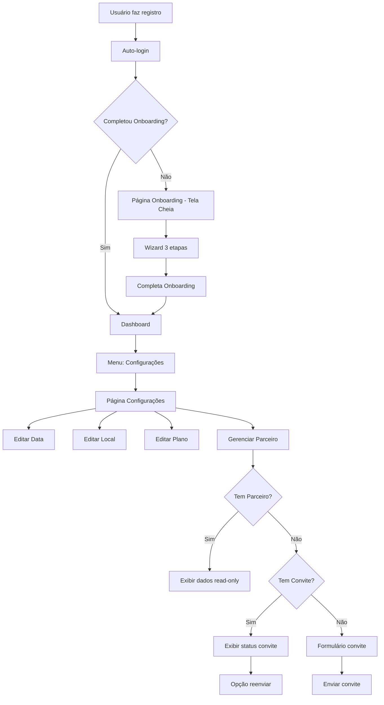
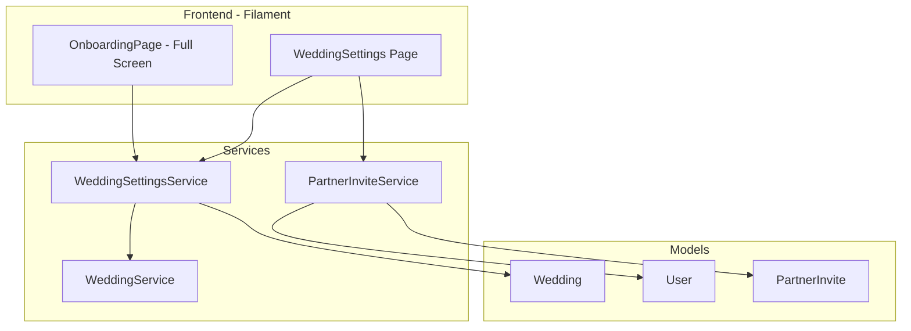

# Documento de Design

## Visão Geral

Este documento descreve o design técnico para as melhorias no fluxo de onboarding e criação da página de configurações do casamento. As melhorias incluem um layout limpo para o onboarding (sem menu/header), destaque visual no campo de data, e uma nova página para editar dados do casamento após o onboarding.

## Arquitetura

### Diagrama de Fluxo



### Diagrama de Componentes



## Componentes e Interfaces

### 1. OnboardingPage - Layout Tela Cheia

Modificações na página de onboarding existente para exibir em tela cheia sem menu lateral.

```php
<?php

namespace App\Filament\Pages;

class Onboarding extends Page implements HasForms
{
    // Configurações para layout limpo
    protected static ?string $layout = 'filament-panels::components.layout.simple';
    
    // Ou usar view customizada
    protected static string $view = 'filament.pages.onboarding-fullscreen';
    
    // Desabilitar navegação
    protected static bool $shouldRegisterNavigation = false;
    
    // Método para verificar se deve usar layout simples
    public function getLayout(): string
    {
        return 'filament-panels::components.layout.simple';
    }
}
```

### 2. WeddingSettingsPage

Nova página Filament para edição dos dados do casamento.

```php
<?php

namespace App\Filament\Pages;

class WeddingSettings extends Page implements HasForms
{
    protected static ?string $navigationIcon = 'heroicon-o-cog-6-tooth';
    protected static ?string $navigationLabel = 'Configurações';
    protected static ?string $title = 'Configurações do Casamento';
    protected static ?string $slug = 'wedding-settings';
    protected static ?int $navigationSort = 100;
    
    public ?array $data = [];
    
    public function mount(): void
    {
        $wedding = $this->getWedding();
        $this->form->fill([
            'wedding_date' => $wedding->wedding_date,
            'venue_name' => $wedding->venue,
            'venue_city' => $wedding->city,
            'venue_state' => $wedding->state,
            'venue_address' => $wedding->settings['venue_address'] ?? null,
            'venue_neighborhood' => $wedding->settings['venue_neighborhood'] ?? null,
            'venue_phone' => $wedding->settings['venue_phone'] ?? null,
            'plan' => $wedding->settings['plan'] ?? 'basic',
        ]);
    }
    
    public function form(Form $form): Form
    {
        return $form
            ->schema([
                $this->getWeddingDateSection(),
                $this->getVenueSection(),
                $this->getPlanSection(),
                $this->getPartnerSection(),
            ])
            ->statePath('data');
    }
    
    public static function canAccess(): bool
    {
        $user = auth()->user();
        $weddingId = session('filament_wedding_id');
        
        if (!$user || !$weddingId) {
            return false;
        }
        
        // Verificar se usuário tem papel "couple" no casamento
        return $user->weddings()
            ->where('wedding_id', $weddingId)
            ->where('role', 'couple')
            ->exists();
    }
}
```

### 3. WeddingSettingsService

Serviço para gerenciar atualizações dos dados do casamento.

```php
<?php

namespace App\Services;

interface WeddingSettingsServiceInterface
{
    /**
     * Atualiza os dados do casamento.
     * 
     * @param Wedding $wedding Casamento a ser atualizado
     * @param array $data Dados a serem atualizados
     * @return Wedding Casamento atualizado
     */
    public function update(Wedding $wedding, array $data): Wedding;
    
    /**
     * Verifica se o usuário pode editar o casamento.
     * 
     * @param User $user Usuário
     * @param Wedding $wedding Casamento
     * @return bool
     */
    public function canEdit(User $user, Wedding $wedding): bool;
}
```

```php
<?php

namespace App\Services;

class WeddingSettingsService implements WeddingSettingsServiceInterface
{
    public function update(Wedding $wedding, array $data): Wedding
    {
        $wedding->update([
            'wedding_date' => $data['wedding_date'] ?? $wedding->wedding_date,
            'venue' => $data['venue_name'] ?? $wedding->venue,
            'city' => $data['venue_city'] ?? $wedding->city,
            'state' => $data['venue_state'] ?? $wedding->state,
            'settings' => array_merge($wedding->settings ?? [], [
                'plan' => $data['plan'] ?? ($wedding->settings['plan'] ?? 'basic'),
                'venue_address' => $data['venue_address'] ?? null,
                'venue_neighborhood' => $data['venue_neighborhood'] ?? null,
                'venue_phone' => $data['venue_phone'] ?? null,
            ]),
        ]);
        
        return $wedding->fresh();
    }
    
    public function canEdit(User $user, Wedding $wedding): bool
    {
        return $user->weddings()
            ->where('wedding_id', $wedding->id)
            ->where('role', 'couple')
            ->exists();
    }
}
```

## Modelos de Dados

### Estrutura de Dados da Página de Configurações

```php
// Dados do formulário de configurações
$settingsData = [
    // Seção Data
    'wedding_date' => '2026-12-15',
    
    // Seção Local
    'venue_name' => 'Espaço Jardim',
    'venue_address' => 'Rua das Flores, 123',
    'venue_neighborhood' => 'Centro',
    'venue_city' => 'São Paulo',
    'venue_state' => 'SP',
    'venue_phone' => '11999999999',
    
    // Seção Plano
    'plan' => 'basic', // basic ou premium
    
    // Seção Parceiro (apenas para envio de convite)
    'partner_name' => 'Maria Silva',
    'partner_email' => 'maria@email.com',
];
```

### Estados do Parceiro

```php
// Enum para estados do parceiro na UI
enum PartnerStatus: string
{
    case NO_PARTNER = 'no_partner';           // Sem parceiro, sem convite
    case INVITE_PENDING = 'invite_pending';   // Convite enviado, aguardando
    case INVITE_EXPIRED = 'invite_expired';   // Convite expirado
    case INVITE_DECLINED = 'invite_declined'; // Convite recusado
    case PARTNER_LINKED = 'partner_linked';   // Parceiro vinculado
}
```

## Propriedades de Corretude

*Uma propriedade é uma característica ou comportamento que deve ser verdadeiro em todas as execuções válidas de um sistema - essencialmente, uma declaração formal sobre o que o sistema deve fazer. Propriedades servem como ponte entre especificações legíveis por humanos e garantias de corretude verificáveis por máquina.*

### Propriedade 1: Controle de Acesso à Página de Configurações

*Para qualquer* usuário e casamento, o usuário só deve ter acesso à página de configurações se tiver papel "couple" no casamento. Usuários com outros papéis ou sem vínculo devem ser bloqueados.

**Valida: Requisitos 3.4**

### Propriedade 2: Round-Trip de Persistência de Dados

*Para qualquer* conjunto válido de dados de configuração (data, local, plano), salvar os dados e depois carregar a página novamente deve retornar os mesmos dados que foram salvos.

**Valida: Requisitos 3.3, 4.3, 5.2, 6.2**

### Propriedade 3: Validação de Data Futura

*Para qualquer* data fornecida como data do casamento, se a data está no passado, a validação deve falhar. Se a data está no futuro ou é hoje, a validação deve passar.

**Valida: Requisitos 4.2**

### Propriedade 4: Campos de Local Opcionais

*Para qualquer* combinação de campos de local (todos preenchidos, alguns preenchidos, nenhum preenchido), o salvamento deve ser bem-sucedido sem erros de validação.

**Valida: Requisitos 5.3**

### Propriedade 5: Estado dos Campos de Parceiro

*Para qualquer* casamento:
- Se o casamento tem um parceiro vinculado, os campos de parceiro devem estar em modo somente leitura
- Se o casamento não tem parceiro vinculado, os campos de parceiro devem estar editáveis

**Valida: Requisitos 7.2, 7.3**

### Propriedade 6: Criação de Convite ao Salvar Dados de Parceiro

*Para qualquer* dados válidos de parceiro (nome e e-mail válidos) em um casamento sem parceiro vinculado, ao salvar, um convite deve ser criado com status "pending".

**Valida: Requisitos 7.4**

### Propriedade 7: Validação de E-mail do Parceiro

*Para qualquer* string fornecida como e-mail do parceiro:
- Se não é um formato de e-mail válido, a validação deve falhar
- Se é igual ao e-mail do usuário atual, a validação deve falhar
- Se é um e-mail válido e diferente do usuário atual, a validação deve passar

**Valida: Requisitos 7.6, 7.7**

### Propriedade 8: Exibição Correta de Status do Convite

*Para qualquer* casamento com convite existente:
- Se status é "pending", deve exibir "Convite enviado - Aguardando aceite"
- Se status é "expired", deve exibir "Convite expirado" com opção de reenviar
- Se status é "declined", deve exibir "Convite recusado" com opção de novo convite
- Se parceiro está vinculado (convite aceito), deve exibir dados do parceiro

**Valida: Requisitos 7.5, 8.1, 8.2, 8.3, 8.4**

## Tratamento de Erros

### Erros de Validação

| Código | Mensagem | Causa |
|--------|----------|-------|
| `INVALID_DATE` | "A data do casamento deve ser uma data futura" | Data no passado |
| `INVALID_EMAIL_FORMAT` | "O e-mail informado não é válido" | E-mail com formato inválido |
| `SAME_EMAIL` | "O e-mail do parceiro deve ser diferente do seu" | E-mail igual ao do usuário |
| `ACCESS_DENIED` | "Você não tem permissão para editar este casamento" | Usuário sem papel "couple" |

### Erros de Processamento

| Código | Mensagem | Causa |
|--------|----------|-------|
| `UPDATE_FAILED` | "Erro ao salvar alterações. Tente novamente." | Falha na atualização |
| `INVITE_SEND_FAILED` | "Erro ao enviar convite. Tente novamente." | Falha no envio do convite |

## Estratégia de Testes

### Testes Unitários

1. **WeddingSettingsService**
   - Testar atualização de dados completos
   - Testar atualização parcial (apenas alguns campos)
   - Testar verificação de permissão canEdit

2. **Validações**
   - Testar validação de data futura
   - Testar validação de e-mail do parceiro
   - Testar campos opcionais de local

### Testes de Propriedade (Property-Based Testing)

Utilizaremos **PHPUnit com Eris** para testes de propriedade.

1. **Propriedade 1**: Gerar usuários com diferentes papéis e verificar controle de acesso
2. **Propriedade 2**: Gerar dados aleatórios de configuração, salvar e verificar round-trip
3. **Propriedade 3**: Gerar datas aleatórias e verificar validação de data futura
4. **Propriedade 4**: Gerar combinações de campos de local e verificar salvamento
5. **Propriedade 5**: Gerar casamentos com/sem parceiro e verificar estado dos campos
6. **Propriedade 6**: Gerar dados de parceiro e verificar criação de convite
7. **Propriedade 7**: Gerar strings e verificar validação de e-mail
8. **Propriedade 8**: Gerar convites com diferentes status e verificar exibição

### Configuração de Testes de Propriedade

```php
// Mínimo de 100 iterações por teste de propriedade
// Tag format: Feature: onboarding-improvements, Property N: [descrição]
```

### Testes de Interface

1. **OnboardingPage**
   - Verificar que menu lateral está oculto
   - Verificar que header está oculto
   - Verificar destaque visual no campo de data

2. **WeddingSettingsPage**
   - Verificar presença de todas as seções
   - Verificar carregamento de dados existentes
   - Verificar salvamento de alterações

