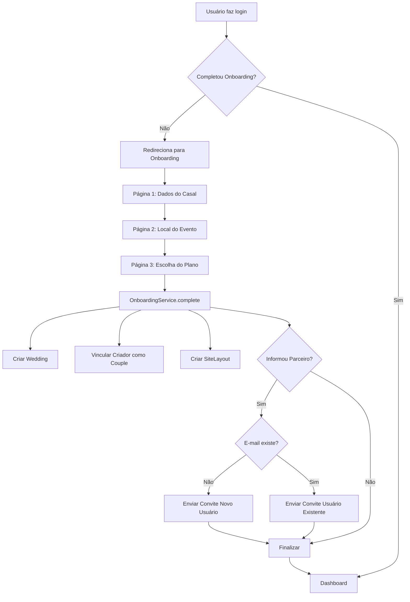
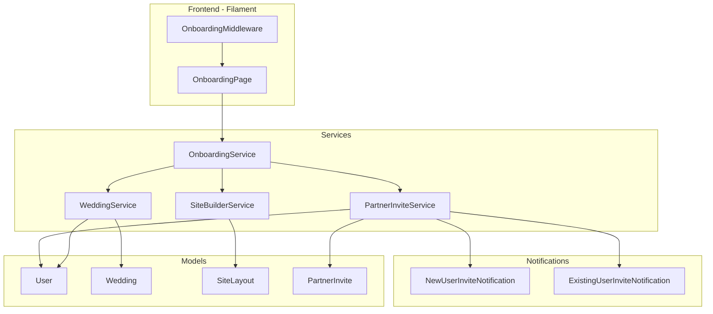

# Documento de Design

## Visão Geral

Este documento descreve o design técnico para o fluxo de onboarding de configuração inicial do sistema "Dia Marcado". O onboarding é um processo de 3 etapas implementado como uma página Filament multi-step que coleta informações do casal, local do evento e plano escolhido, culminando na criação automática de um casamento e site.

## Arquitetura

### Diagrama de Fluxo



### Diagrama de Componentes



## Componentes e Interfaces

### 1. OnboardingMiddleware

Middleware que intercepta todas as requisições e verifica se o usuário completou o onboarding.

```php
<?php

namespace App\Http\Middleware;

class EnsureOnboardingComplete
{
    public function handle(Request $request, Closure $next): Response
    {
        $user = $request->user();
        
        if ($user && !$user->isAdmin() && !$user->hasCompletedOnboarding()) {
            // Permite acesso apenas à página de onboarding
            if (!$this->isOnboardingRoute($request)) {
                return redirect()->route('filament.admin.pages.onboarding');
            }
        }
        
        return $next($request);
    }
    
    private function isOnboardingRoute(Request $request): bool
    {
        return $request->routeIs('filament.admin.pages.onboarding');
    }
}
```

### 2. OnboardingPage (Filament Page)

Página Filament com wizard de 3 etapas usando o componente Wizard do Filament.

```php
<?php

namespace App\Filament\Pages;

use Filament\Forms\Components\Wizard;
use Filament\Forms\Components\Wizard\Step;

class Onboarding extends Page implements HasForms
{
    protected static string $view = 'filament.pages.onboarding';
    protected static ?string $slug = 'onboarding';
    protected static bool $shouldRegisterNavigation = false;
    
    public ?array $data = [];
    
    public function form(Form $form): Form
    {
        return $form
            ->schema([
                Wizard::make([
                    Step::make('Dados do Casal')
                        ->icon('heroicon-o-heart')
                        ->schema($this->getCoupleDataSchema()),
                    
                    Step::make('Local do Evento')
                        ->icon('heroicon-o-map-pin')
                        ->schema($this->getVenueDataSchema()),
                    
                    Step::make('Escolha do Plano')
                        ->icon('heroicon-o-star')
                        ->schema($this->getPlanSchema()),
                ])
                ->submitAction($this->getSubmitAction())
            ])
            ->statePath('data');
    }
    
    public function complete(): void
    {
        $data = $this->form->getState();
        $user = auth()->user();
        
        app(OnboardingService::class)->complete($user, $data);
        
        redirect()->route('filament.admin.pages.dashboard');
    }
}
```

### 3. OnboardingService

Serviço principal que orquestra todo o processo de conclusão do onboarding.

```php
<?php

namespace App\Services;

interface OnboardingServiceInterface
{
    /**
     * Completa o processo de onboarding para um usuário.
     * 
     * @param User $user Usuário que está completando o onboarding
     * @param array $data Dados coletados nas 3 etapas
     * @return Wedding O casamento criado
     * @throws OnboardingException Se ocorrer erro durante o processo
     */
    public function complete(User $user, array $data): Wedding;
    
    /**
     * Verifica se um usuário completou o onboarding.
     * 
     * @param User $user Usuário a verificar
     * @return bool True se completou, false caso contrário
     */
    public function hasCompleted(User $user): bool;
}
```

### 4. PartnerInviteService

Serviço responsável por gerenciar convites para parceiros.

```php
<?php

namespace App\Services;

interface PartnerInviteServiceInterface
{
    /**
     * Envia convite para o parceiro.
     * 
     * @param Wedding $wedding Casamento ao qual o parceiro será convidado
     * @param User $inviter Usuário que está convidando
     * @param string $partnerEmail E-mail do parceiro
     * @param string $partnerName Nome do parceiro
     * @return PartnerInvite O convite criado
     */
    public function sendInvite(
        Wedding $wedding, 
        User $inviter, 
        string $partnerEmail, 
        string $partnerName
    ): PartnerInvite;
    
    /**
     * Aceita um convite de parceiro.
     * 
     * @param PartnerInvite $invite Convite a ser aceito
     * @param User $user Usuário que está aceitando (pode ser novo ou existente)
     * @return void
     */
    public function acceptInvite(PartnerInvite $invite, User $user): void;
    
    /**
     * Recusa um convite de parceiro.
     * 
     * @param PartnerInvite $invite Convite a ser recusado
     * @return void
     */
    public function declineInvite(PartnerInvite $invite): void;
}
```

## Modelos de Dados

### Alterações no Model User

```php
// Adicionar campo para controle de onboarding
Schema::table('users', function (Blueprint $table) {
    $table->boolean('onboarding_completed')->default(false);
});
```

### Novo Model: PartnerInvite

```php
<?php

namespace App\Models;

class PartnerInvite extends Model
{
    use HasUuids;
    
    protected $fillable = [
        'wedding_id',
        'inviter_id',
        'email',
        'name',
        'token',
        'status', // pending, accepted, declined, expired
        'existing_user_id', // Se o e-mail já existe na plataforma
        'previous_wedding_id', // Casamento anterior do usuário existente
        'expires_at',
    ];
    
    protected $casts = [
        'expires_at' => 'datetime',
    ];
}
```

### Migration para PartnerInvite

```php
Schema::create('partner_invites', function (Blueprint $table) {
    $table->uuid('id')->primary();
    $table->foreignUuid('wedding_id')->constrained()->cascadeOnDelete();
    $table->foreignUuid('inviter_id')->constrained('users')->cascadeOnDelete();
    $table->string('email');
    $table->string('name');
    $table->string('token')->unique();
    $table->enum('status', ['pending', 'accepted', 'declined', 'expired'])->default('pending');
    $table->foreignUuid('existing_user_id')->nullable()->constrained('users')->nullOnDelete();
    $table->foreignUuid('previous_wedding_id')->nullable()->constrained('weddings')->nullOnDelete();
    $table->timestamp('expires_at');
    $table->timestamps();
    
    $table->index(['email', 'status']);
    $table->index(['token']);
});
```

### Estrutura de Dados do Onboarding

```php
// Dados coletados no formulário
$onboardingData = [
    // Página 1 - Dados do Casal
    'wedding_date' => '2026-12-15', // Data do casamento
    'partner_name' => 'Maria Silva', // Opcional
    'partner_email' => 'maria@email.com', // Opcional
    
    // Página 2 - Local do Evento
    'venue_name' => 'Espaço Jardim', // Opcional
    'venue_address' => 'Rua das Flores, 123', // Opcional
    'venue_neighborhood' => 'Centro', // Opcional
    'venue_city' => 'São Paulo', // Opcional
    'venue_state' => 'SP', // Opcional
    'venue_phone' => '11999999999', // Opcional
    
    // Página 3 - Plano
    'plan' => 'basic', // basic ou premium
];
```

## Propriedades de Corretude

*Uma propriedade é uma característica ou comportamento que deve ser verdadeiro em todas as execuções válidas de um sistema - essencialmente, uma declaração formal sobre o que o sistema deve fazer. Propriedades servem como ponte entre especificações legíveis por humanos e garantias de corretude verificáveis por máquina.*

### Propriedade 1: Controle de Acesso Baseado em Status de Onboarding

*Para qualquer* usuário não-admin, se o usuário não completou o onboarding, então qualquer tentativa de acessar páginas do sistema (exceto a página de onboarding) deve resultar em redirecionamento para a página de onboarding. Inversamente, se o usuário completou o onboarding, então deve ter acesso ao dashboard.

**Valida: Requisitos 1.1, 1.2, 1.4**

### Propriedade 2: Validação de E-mail do Parceiro

*Para qualquer* string fornecida como e-mail do parceiro:
- Se a string não é um formato de e-mail válido, a validação deve falhar
- Se a string é igual ao e-mail do usuário atual, a validação deve falhar
- Se a string é um e-mail válido e diferente do usuário atual, a validação deve passar

**Valida: Requisitos 3.5, 7.2**

### Propriedade 3: Dependência de Campos do Parceiro

*Para qualquer* estado do formulário da Página 1:
- Se o campo de e-mail do parceiro está preenchido, então o campo de nome do parceiro deve ser obrigatório
- Se o campo de e-mail do parceiro está vazio, então o campo de nome do parceiro pode estar vazio

**Valida: Requisito 3.6**

### Propriedade 4: Tipo de Convite Baseado em Existência do E-mail

*Para qualquer* e-mail de parceiro válido fornecido durante o onboarding:
- Se o e-mail não existe na plataforma, então um convite do tipo "novo usuário" deve ser enviado
- Se o e-mail já existe na plataforma, então um convite do tipo "usuário existente" deve ser enviado com disclaimer sobre desvinculação

**Valida: Requisitos 3.1.1, 3.2.1, 3.2.3**

### Propriedade 5: Conteúdo do E-mail de Convite

*Para qualquer* convite enviado, o e-mail deve conter o nome completo do usuário que está convidando.

**Valida: Requisito 3.1.2**

### Propriedade 6: Vinculação de Parceiro Após Aceite

*Para qualquer* convite aceito:
- O usuário que aceitou deve ser vinculado ao casamento com papel "couple"
- Se o usuário já estava vinculado a outro casamento, deve ser desvinculado do anterior

**Valida: Requisitos 3.1.4, 3.2.5**

### Propriedade 7: Estado do Casamento Antes do Aceite

*Para qualquer* casamento criado via onboarding, enquanto o convite do parceiro não for aceito, o casamento deve ter apenas o criador como "couple".

**Valida: Requisitos 3.1.5, 3.2.7**

### Propriedade 8: Criação de Dados ao Concluir Onboarding

*Para qualquer* conclusão de onboarding com dados válidos:
- Um registro de Wedding deve ser criado com os dados fornecidos
- O usuário criador deve ser associado ao casamento com papel "couple"
- Um SiteLayout deve ser criado para o casamento
- O usuário deve ser marcado como tendo completado o onboarding

**Valida: Requisitos 6.1, 6.2, 6.4, 6.9**

### Propriedade 9: Unicidade de Slug

*Para qualquer* site criado durante o onboarding, o slug gerado deve ser único no sistema. Se um slug baseado nos nomes já existir, um sufixo numérico deve ser adicionado.

**Valida: Requisitos 6.5, 6.6**

### Propriedade 10: Persistência de Estado do Onboarding

*Para qualquer* navegação entre páginas do onboarding ou refresh da página, os dados inseridos pelo usuário devem ser preservados e restaurados.

**Valida: Requisitos 1.3, 8.1**

### Propriedade 11: Reset de Onboarding Após Logout

*Para qualquer* usuário que faz logout sem completar o onboarding e depois faz login novamente, o onboarding deve reiniciar da Página 1.

**Valida: Requisito 8.3**

## Tratamento de Erros

### Erros de Validação

| Código | Mensagem | Causa |
|--------|----------|-------|
| `INVALID_EMAIL_FORMAT` | "O e-mail informado não é válido" | E-mail do parceiro com formato inválido |
| `SAME_EMAIL` | "O e-mail do parceiro deve ser diferente do seu" | E-mail do parceiro igual ao do criador |
| `PARTNER_NAME_REQUIRED` | "Informe o nome do parceiro" | E-mail preenchido mas nome vazio |

### Erros de Processamento

| Código | Mensagem | Causa |
|--------|----------|-------|
| `WEDDING_CREATION_FAILED` | "Erro ao criar o casamento. Tente novamente." | Falha na criação do Wedding |
| `SITE_CREATION_FAILED` | "Erro ao criar o site. Tente novamente." | Falha na criação do SiteLayout |
| `INVITE_SEND_FAILED` | "Erro ao enviar convite. Tente novamente." | Falha no envio do e-mail de convite |

### Estratégia de Retry

- Todas as operações de criação são executadas em transação
- Em caso de falha, a transação é revertida
- O usuário pode tentar novamente clicando em "Concluir"
- Logs detalhados são registrados para debugging

## Estratégia de Testes

### Testes Unitários

1. **OnboardingService**
   - Testar criação de wedding com dados completos
   - Testar criação de wedding com dados mínimos (sem parceiro, sem local)
   - Testar marcação de onboarding como completo

2. **PartnerInviteService**
   - Testar envio de convite para novo usuário
   - Testar envio de convite para usuário existente
   - Testar aceite de convite
   - Testar recusa de convite
   - Testar desvinculação de casamento anterior

3. **Validações**
   - Testar validação de formato de e-mail
   - Testar validação de e-mail diferente do criador
   - Testar dependência nome/e-mail do parceiro

### Testes de Propriedade (Property-Based Testing)

Utilizaremos **PHPUnit com Eris** para testes de propriedade.

1. **Propriedade 1**: Gerar usuários aleatórios com diferentes status de onboarding e verificar controle de acesso
2. **Propriedade 2**: Gerar strings aleatórias e verificar validação de e-mail
3. **Propriedade 3**: Gerar combinações de preenchimento de campos e verificar dependência
4. **Propriedade 4**: Gerar e-mails e verificar tipo de convite baseado em existência
5. **Propriedade 6**: Gerar convites e verificar vinculação após aceite
6. **Propriedade 8**: Gerar dados de onboarding e verificar criação correta
7. **Propriedade 9**: Gerar nomes de casais e verificar unicidade de slug
8. **Propriedade 10**: Gerar dados de formulário e verificar persistência

### Configuração de Testes de Propriedade

```php
// Mínimo de 100 iterações por teste de propriedade
// Tag format: Feature: user-onboarding, Property N: [descrição]
```
