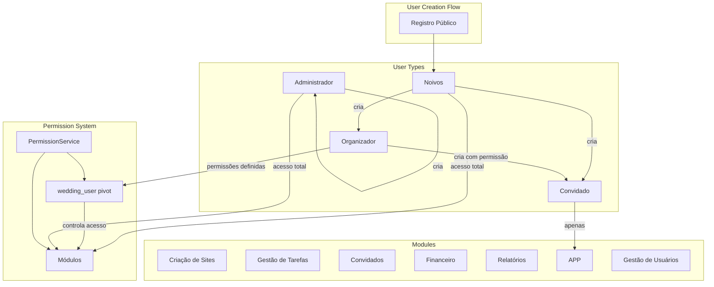

# Design Document: User Role Management

## Overview

Este documento descreve a arquitetura técnica do sistema de gestão de usuários e permissões do SaaS de Casamentos. O sistema implementa uma hierarquia de usuários (Noivos, Organizadores, Convidados, Administradores) com controle granular de permissões por módulo.

A arquitetura estende o sistema existente de multi-tenancy por `wedding_id`, adicionando camadas de controle de acesso baseadas em roles e permissões configuráveis.

## Architecture



## Components and Interfaces

### 1. UserRegistrationService

Serviço responsável pelo registro público de novos usuários (sempre como Noivos).

```php
<?php

namespace App\Services;

use App\Models\User;
use Illuminate\Support\Facades\Hash;
use Illuminate\Validation\ValidationException;

class UserRegistrationService
{
    public function registerCouple(array $data): User
    {
        $this->validateRegistrationData($data);
        $this->ensureEmailIsUnique($data['email']);
        
        return User::create([
            'name' => $data['name'],
            'email' => $data['email'],
            'password' => Hash::make($data['password']),
            'role' => 'couple',
        ]);
    }
    
    private function validateRegistrationData(array $data): void
    {
        $required = ['name', 'email', 'password'];
        foreach ($required as $field) {
            if (empty($data[$field])) {
                throw ValidationException::withMessages([
                    $field => ["O campo {$field} é obrigatório."],
                ]);
            }
        }
    }
    
    private function ensureEmailIsUnique(string $email): void
    {
        if (User::where('email', $email)->exists()) {
            throw ValidationException::withMessages([
                'email' => ['Este email já está em uso.'],
            ]);
        }
    }
}
```

### 2. UserManagementService

Serviço para criação e gestão de usuários dentro de um casamento.

```php
<?php

namespace App\Services;

use App\Models\User;
use App\Models\Wedding;
use Illuminate\Support\Facades\Hash;
use Illuminate\Support\Str;
use Symfony\Component\HttpKernel\Exception\AccessDeniedHttpException;

class UserManagementService
{
    public function __construct(
        private PermissionService $permissionService
    ) {}
    
    public function createOrganizer(
        User $creator,
        Wedding $wedding,
        array $data,
        array $permissions = []
    ): User {
        $this->ensureCanCreateOrganizer($creator, $wedding);
        
        $user = User::create([
            'name' => $data['name'],
            'email' => $data['email'],
            'password' => Hash::make($data['password'] ?? Str::random(16)),
            'role' => 'organizer',
            'created_by' => $creator->id,
        ]);
        
        $wedding->users()->attach($user->id, [
            'role' => 'organizer',
            'permissions' => $permissions,
        ]);
        
        return $user;
    }
    
    public function createGuest(
        User $creator,
        Wedding $wedding,
        array $data
    ): User {
        $this->ensureCanCreateGuest($creator, $wedding);
        
        $password = $data['password'] ?? null;
        $sendInvite = empty($password);
        
        $user = User::create([
            'name' => $data['name'],
            'email' => $data['email'],
            'password' => $password ? Hash::make($password) : null,
            'role' => 'guest',
            'created_by' => $creator->id,
        ]);
        
        $wedding->users()->attach($user->id, [
            'role' => 'guest',
            'permissions' => [],
        ]);
        
        if ($sendInvite) {
            // Dispatch invite email job
            // InviteGuestJob::dispatch($user, $wedding);
        }
        
        return $user;
    }
    
    public function createAdmin(User $creator, array $data): User
    {
        $this->ensureCanCreateAdmin($creator);
        
        return User::create([
            'name' => $data['name'],
            'email' => $data['email'],
            'password' => Hash::make($data['password']),
            'role' => 'admin',
            'created_by' => $creator->id,
        ]);
    }
    
    public function removeFromWedding(User $user, Wedding $wedding): void
    {
        $wedding->users()->detach($user->id);
    }
    
    private function ensureCanCreateOrganizer(User $creator, Wedding $wedding): void
    {
        if (!$creator->isAdmin() && !$creator->isCoupleIn($wedding)) {
            throw new AccessDeniedHttpException(
                'Apenas Noivos podem criar Organizadores.'
            );
        }
    }
    
    private function ensureCanCreateGuest(User $creator, Wedding $wedding): void
    {
        $canCreate = $creator->isAdmin() 
            || $creator->isCoupleIn($wedding)
            || ($creator->isOrganizerIn($wedding) 
                && $creator->hasPermissionIn($wedding, 'users'));
        
        if (!$canCreate) {
            throw new AccessDeniedHttpException(
                'Você não tem permissão para criar Convidados.'
            );
        }
    }
    
    private function ensureCanCreateAdmin(User $creator): void
    {
        if (!$creator->isAdmin()) {
            throw new AccessDeniedHttpException(
                'Apenas Administradores podem criar outros Administradores.'
            );
        }
    }
}
```

### 3. PermissionManagementService

Serviço para gestão de permissões de Organizadores.

```php
<?php

namespace App\Services;

use App\Models\User;
use App\Models\Wedding;
use Symfony\Component\HttpKernel\Exception\AccessDeniedHttpException;

class PermissionManagementService
{
    public const AVAILABLE_MODULES = [
        'sites' => 'Criação de Sites',
        'tasks' => 'Gestão de Tarefas',
        'guests' => 'Convidados',
        'finance' => 'Financeiro',
        'reports' => 'Relatórios',
        'app' => 'APP',
        'users' => 'Gestão de Usuários',
    ];
    
    public function updateOrganizerPermissions(
        User $editor,
        Wedding $wedding,
        User $organizer,
        array $permissions
    ): void {
        $this->ensureCanManagePermissions($editor, $wedding);
        $this->ensureIsOrganizerInWedding($organizer, $wedding);
        $this->validatePermissions($permissions);
        
        $wedding->users()->updateExistingPivot($organizer->id, [
            'permissions' => $permissions,
        ]);
    }
    
    public function getOrganizersWithPermissions(
        User $viewer,
        Wedding $wedding
    ): array {
        $this->ensureCanManagePermissions($viewer, $wedding);
        
        return $wedding->organizers()
            ->get()
            ->map(fn ($user) => [
                'id' => $user->id,
                'name' => $user->name,
                'email' => $user->email,
                'permissions' => $user->pivot->permissions ?? [],
            ])
            ->toArray();
    }
    
    private function ensureCanManagePermissions(User $user, Wedding $wedding): void
    {
        if (!$user->isAdmin() && !$user->isCoupleIn($wedding)) {
            throw new AccessDeniedHttpException(
                'Apenas Noivos e Administradores podem gerenciar permissões.'
            );
        }
    }
    
    private function ensureIsOrganizerInWedding(User $user, Wedding $wedding): void
    {
        if (!$user->isOrganizerIn($wedding)) {
            throw new AccessDeniedHttpException(
                'O usuário não é um Organizador deste casamento.'
            );
        }
    }
    
    private function validatePermissions(array $permissions): void
    {
        $validModules = array_keys(self::AVAILABLE_MODULES);
        foreach ($permissions as $permission) {
            if (!in_array($permission, $validModules)) {
                throw new \InvalidArgumentException(
                    "Módulo inválido: {$permission}"
                );
            }
        }
    }
}
```

### 4. AdminAuditService

Serviço para auditoria de ações de Administradores.

```php
<?php

namespace App\Services;

use App\Models\AdminAuditLog;
use App\Models\User;
use App\Models\Wedding;

class AdminAuditService
{
    public function logAction(
        User $admin,
        Wedding $wedding,
        string $action,
        array $details = []
    ): void {
        if (!$admin->isAdmin()) {
            return;
        }
        
        // Verificar se é casamento de terceiro
        if ($admin->isCoupleIn($wedding)) {
            return;
        }
        
        AdminAuditLog::create([
            'admin_id' => $admin->id,
            'wedding_id' => $wedding->id,
            'action' => $action,
            'details' => $details,
            'performed_at' => now(),
        ]);
    }
}
```

### 5. UserListingService

Serviço para listagem e filtros de usuários.

```php
<?php

namespace App\Services;

use App\Models\User;
use App\Models\Wedding;
use Illuminate\Database\Eloquent\Builder;
use Illuminate\Pagination\LengthAwarePaginator;

class UserListingService
{
    public function listUsers(
        User $viewer,
        Wedding $wedding,
        array $filters = []
    ): LengthAwarePaginator {
        $query = $wedding->users();
        
        // Organizador só vê Convidados
        if ($viewer->isOrganizerIn($wedding)) {
            $query->wherePivot('role', 'guest');
        }
        
        // Filtro por tipo
        if (!empty($filters['type'])) {
            $query->wherePivot('role', $filters['type']);
        }
        
        // Busca por nome ou email
        if (!empty($filters['search'])) {
            $search = $filters['search'];
            $query->where(function (Builder $q) use ($search) {
                $q->where('name', 'ilike', "%{$search}%")
                  ->orWhere('email', 'ilike', "%{$search}%");
            });
        }
        
        // Ordenação
        $sortField = $filters['sort'] ?? 'created_at';
        $sortDirection = $filters['direction'] ?? 'desc';
        
        if ($sortField === 'type') {
            $query->orderByPivot('role', $sortDirection);
        } else {
            $query->orderBy($sortField, $sortDirection);
        }
        
        return $query->paginate(15);
    }
}
```

## Data Models

### Entity Relationship Diagram

```mermaid
erDiagram
    users ||--o{ wedding_user : "participa"
    weddings ||--o{ wedding_user : "tem"
    users ||--o{ admin_audit_logs : "realiza"
    weddings ||--o{ admin_audit_logs : "afetado"
    users ||--o{ users : "cria"
    
    users {
        uuid id PK
        string name
        string email
        string password
        enum role "admin|couple|organizer|guest"
        uuid current_wedding_id FK
        uuid created_by FK
        timestamps
    }
    
    weddings {
        uuid id PK
        string title
        date wedding_date
        jsonb settings
        boolean is_active
        timestamps
    }
    
    wedding_user {
        uuid id PK
        uuid user_id FK
        uuid wedding_id FK
        enum role "couple|organizer|guest"
        jsonb permissions
        timestamps
    }
    
    admin_audit_logs {
        uuid id PK
        uuid admin_id FK
        uuid wedding_id FK
        string action
        jsonb details
        timestamp performed_at
        timestamps
    }
}
```

### Migration: Add created_by to Users

```php
Schema::table('users', function (Blueprint $table) {
    $table->uuid('created_by')->nullable()->after('current_wedding_id');
    $table->foreign('created_by')->references('id')->on('users')->nullOnDelete();
});
```

### Migration: Admin Audit Logs

```php
Schema::create('admin_audit_logs', function (Blueprint $table) {
    $table->uuid('id')->primary();
    $table->uuid('admin_id');
    $table->uuid('wedding_id');
    $table->string('action');
    $table->jsonb('details')->default('{}');
    $table->timestamp('performed_at');
    $table->timestamps();
    
    $table->foreign('admin_id')->references('id')->on('users')->onDelete('cascade');
    $table->foreign('wedding_id')->references('id')->on('weddings')->onDelete('cascade');
    $table->index(['admin_id', 'performed_at']);
    $table->index(['wedding_id', 'performed_at']);
});
```

## Correctness Properties

*A property is a characteristic or behavior that should hold true across all valid executions of a system—essentially, a formal statement about what the system should do. Properties serve as the bridge between human-readable specifications and machine-verifiable correctness guarantees.*

### Property 1: Registro Público Sempre Cria Noivos

*For any* dados válidos de registro (nome, email, senha), quando submetidos pelo formulário público, o usuário criado deve ter role "couple".

**Validates: Requirements 1.1**

### Property 2: Noivos Vinculado ao Casamento Criado

*For any* usuário do tipo Noivos que cria um casamento, o sistema deve criar automaticamente um vínculo na tabela pivot com role "couple".

**Validates: Requirements 1.2, 1.3**

### Property 3: Validação de Campos Obrigatórios no Registro

*For any* tentativa de registro com nome, email ou senha vazios, o sistema deve rejeitar com erro de validação.

**Validates: Requirements 1.4**

### Property 4: Email Único no Sistema

*For any* email já existente no sistema, uma tentativa de registro com o mesmo email deve retornar erro de validação.

**Validates: Requirements 1.5**

### Property 5: Criação de Organizador com Permissões

*For any* Noivos criando um Organizador com um conjunto de permissões, o usuário criado deve ter role "organizer" e as permissões devem ser salvas corretamente na pivot.

**Validates: Requirements 2.2, 2.3**

### Property 6: Remoção de Organizador Preserva Usuário

*For any* Organizador removido de um casamento, o registro do usuário deve continuar existindo no sistema, apenas o vínculo com o casamento deve ser removido.

**Validates: Requirements 2.6**

### Property 7: Criação de Convidado com Role Guest

*For any* criação de Convidado por Noivos ou Organizador com permissão, o usuário criado deve ter role "guest" e estar vinculado ao casamento.

**Validates: Requirements 3.2**

### Property 8: Validação de Campos Obrigatórios para Convidado

*For any* tentativa de criar Convidado sem nome ou email, o sistema deve rejeitar com erro de validação.

**Validates: Requirements 3.3**

### Property 9: Hierarquia de Permissões por Role

*For any* usuário e módulo do sistema:
- Administrador tem acesso a todos os módulos de qualquer casamento
- Noivos tem acesso a todos os módulos do seu casamento
- Organizador tem acesso apenas aos módulos configurados em suas permissões
- Convidado tem acesso apenas ao módulo APP

**Validates: Requirements 3.5, 4.1, 5.2, 6.1, 6.2, 6.4**

### Property 10: Alteração de Permissões é Imediata

*For any* alteração de permissões de um Organizador, a próxima verificação de acesso deve refletir as novas permissões.

**Validates: Requirements 4.3, 4.4**

### Property 11: Admin Vê Todos os Casamentos

*For any* Administrador, a listagem de casamentos deve retornar todos os casamentos do sistema.

**Validates: Requirements 5.1**

### Property 12: Log de Ações de Admin em Casamentos de Terceiros

*For any* ação de Administrador em um casamento que não é dele, o sistema deve criar um registro de auditoria com admin_id, wedding_id, action e timestamp.

**Validates: Requirements 5.4, 5.5**

### Property 13: Registro de Created By

*For any* usuário criado no sistema (exceto auto-registro), o campo created_by deve conter o ID do usuário que o criou.

**Validates: Requirements 6.6**

### Property 14: Listagem de Usuários do Casamento

*For any* casamento, a listagem de usuários deve retornar todos os usuários vinculados a ele.

**Validates: Requirements 7.1**

### Property 15: Filtro por Tipo Funciona Corretamente

*For any* filtro de tipo aplicado (Organizador ou Convidado), os resultados devem conter apenas usuários do tipo filtrado. Organizadores só veem Convidados na listagem.

**Validates: Requirements 7.2, 7.5**

### Property 16: Busca por Nome ou Email

*For any* termo de busca, os resultados devem conter apenas usuários cujo nome ou email correspondem ao termo.

**Validates: Requirements 7.3**

### Property 17: Ordenação Funciona Corretamente

*For any* ordenação aplicada (nome, tipo ou data de criação), os resultados devem estar na ordem especificada.

**Validates: Requirements 7.6**

## Error Handling

### Authentication Errors (401 Unauthorized)

| Cenário | Resposta |
|---------|----------|
| Requisição sem autenticação | `{"error": "Unauthorized", "message": "Autenticação necessária"}` |
| Token expirado | `{"error": "Unauthorized", "message": "Token expirado"}` |

### Authorization Errors (403 Forbidden)

| Cenário | Resposta |
|---------|----------|
| Convidado tentando acessar módulo admin | `{"error": "Forbidden", "message": "Acesso negado a este módulo"}` |
| Organizador sem permissão no módulo | `{"error": "Forbidden", "message": "Você não tem permissão para acessar este módulo"}` |
| Tentativa de criar usuário não permitido | `{"error": "Forbidden", "message": "Você não tem permissão para criar este tipo de usuário"}` |
| Organizador tentando criar Organizador | `{"error": "Forbidden", "message": "Apenas Noivos podem criar Organizadores"}` |
| Não-Admin tentando criar Admin | `{"error": "Forbidden", "message": "Apenas Administradores podem criar outros Administradores"}` |

### Validation Errors (422 Unprocessable Entity)

| Cenário | Resposta |
|---------|----------|
| Email já em uso | `{"error": "Validation failed", "errors": {"email": ["Este email já está em uso"]}}` |
| Campo obrigatório vazio | `{"error": "Validation failed", "errors": {"field": ["O campo é obrigatório"]}}` |
| Módulo de permissão inválido | `{"error": "Validation failed", "errors": {"permissions": ["Módulo inválido"]}}` |

## Testing Strategy

### Dual Testing Approach

O sistema utilizará duas abordagens complementares de testes:

1. **Unit Tests**: Verificam exemplos específicos, edge cases e condições de erro
2. **Property-Based Tests**: Verificam propriedades universais com inputs gerados aleatoriamente

### Testing Framework

- **Framework**: PHPUnit (Laravel default)
- **Property-Based Testing**: Eris (PHP property-based testing library)
- **Mínimo de iterações**: 100 por property test

### Property Test Implementation

Cada property test deve:
1. Referenciar a propriedade do design document
2. Usar generators para criar inputs aleatórios
3. Executar mínimo de 100 iterações
4. Incluir tag no formato: `Feature: user-role-management, Property N: {description}`

### Test Categories

| Categoria | Tipo | Cobertura |
|-----------|------|-----------|
| UserRegistrationService | Property | Properties 1, 3, 4 |
| UserManagementService | Property | Properties 5, 6, 7, 8, 13 |
| PermissionService | Property | Property 9, 10 |
| AdminAuditService | Property | Property 12 |
| UserListingService | Property | Properties 14, 15, 16, 17 |
| Wedding Creation | Property | Property 2 |
| Admin Access | Property | Property 11 |

### Generator Strategy

```php
// Generator para dados de registro
class RegistrationDataGenerator
{
    public static function validData(): array
    {
        return [
            'name' => fake()->name(),
            'email' => fake()->unique()->safeEmail(),
            'password' => fake()->password(8),
        ];
    }
    
    public static function invalidData(): array
    {
        $scenarios = [
            ['name' => '', 'email' => fake()->email(), 'password' => 'pass'],
            ['name' => fake()->name(), 'email' => '', 'password' => 'pass'],
            ['name' => fake()->name(), 'email' => fake()->email(), 'password' => ''],
        ];
        return fake()->randomElement($scenarios);
    }
}

// Generator para permissões
class PermissionGenerator
{
    public static function randomPermissions(): array
    {
        $modules = ['sites', 'tasks', 'guests', 'finance', 'reports', 'app', 'users'];
        return fake()->randomElements($modules, rand(0, count($modules)));
    }
}
```
