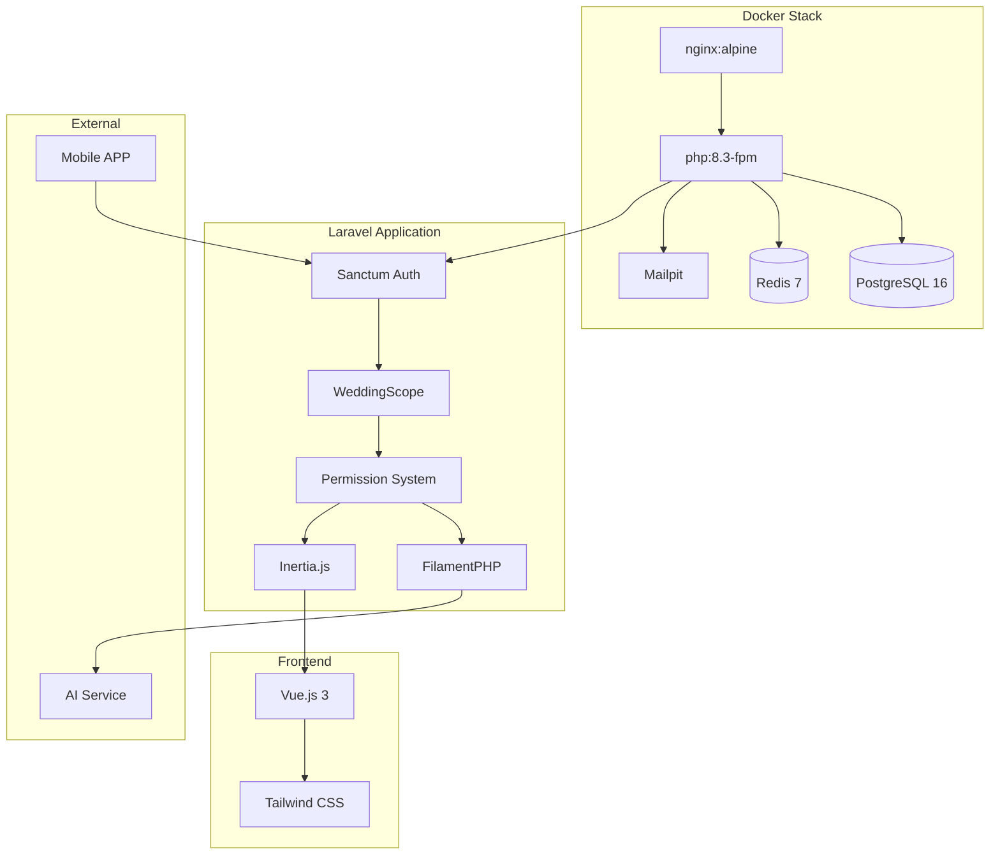

# Design Document: Wedding SaaS Foundation

## Overview

Este documento descreve a arquitetura técnica do SaaS de Casamentos com Single Database. O sistema utiliza Laravel 12 com Global Scopes para isolamento de dados, um sistema de perfis com permissões granulares por módulo, e uma stack Docker otimizada para desenvolvimento local.

A arquitetura segue o padrão de multi-tenancy por coluna (`wedding_id`), onde todos os dados são armazenados em um único banco PostgreSQL, mas filtrados automaticamente pelo escopo do usuário autenticado.

## Architecture



## Components and Interfaces

### 1. WeddingScopedModel (Base Model)

Classe abstrata que todos os Models relacionados a um casamento devem estender.

```php
<?php

namespace App\Models;

use App\Models\Scopes\WeddingScope;
use Illuminate\Database\Eloquent\Model;

abstract class WeddingScopedModel extends Model
{
    protected static function booted(): void
    {
        static::addGlobalScope(new WeddingScope());
        
        static::creating(function (Model $model) {
            if (auth()->check() && !$model->wedding_id) {
                $model->wedding_id = auth()->user()->current_wedding_id;
            }
        });
    }
    
    public function wedding(): BelongsTo
    {
        return $this->belongsTo(Wedding::class);
    }
}
```

### 2. WeddingScope (Global Scope)

Filtro automático que garante isolamento de dados por wedding_id.

```php
<?php

namespace App\Models\Scopes;

use Illuminate\Database\Eloquent\Builder;
use Illuminate\Database\Eloquent\Model;
use Illuminate\Database\Eloquent\Scope;

class WeddingScope implements Scope
{
    public function apply(Builder $builder, Model $model): void
    {
        if (auth()->check()) {
            $user = auth()->user();
            
            // Admin vê tudo
            if ($user->isAdmin()) {
                return;
            }
            
            // Outros perfis veem apenas seus casamentos
            $weddingIds = $user->weddings()->pluck('weddings.id');
            $builder->whereIn('wedding_id', $weddingIds);
        }
    }
}
```

### 3. Permission System

Sistema de permissões baseado em perfis e módulos.

```php
<?php

namespace App\Services;

class PermissionService
{
    public const MODULES = [
        'sites' => 'Criação de Sites',
        'tasks' => 'Gestão de Tarefas', 
        'guests' => 'Convidados',
        'finance' => 'Financeiro',
        'reports' => 'Relatórios',
        'app' => 'APP',
    ];
    
    public const ROLES = [
        'admin' => 'Admin',
        'couple' => 'Noivo/Noiva',
        'organizer' => 'Organizador',
        'guest' => 'Convidado',
    ];
    
    public function canAccess(User $user, string $module, ?Wedding $wedding = null): bool
    {
        if ($user->role === 'admin') {
            return true;
        }
        
        if ($user->role === 'guest') {
            return in_array($module, ['app']);
        }
        
        if (!$wedding) {
            return false;
        }
        
        $pivot = $user->weddings()->where('wedding_id', $wedding->id)->first()?->pivot;
        
        if (!$pivot) {
            return false;
        }
        
        if ($pivot->role === 'couple') {
            return true;
        }
        
        // Organizador - verificar permissões específicas
        $permissions = $pivot->permissions ?? [];
        return in_array($module, $permissions);
    }
}
```

### 4. Sanctum Token com Wedding Context

Middleware para validar token e contexto do casamento.

```php
<?php

namespace App\Http\Middleware;

class EnsureWeddingContext
{
    public function handle(Request $request, Closure $next): Response
    {
        $user = $request->user();
        
        if (!$user) {
            return response()->json(['error' => 'Unauthorized'], 401);
        }
        
        // Admin não precisa de wedding_id
        if ($user->isAdmin()) {
            return $next($request);
        }
        
        $weddingId = $request->header('X-Wedding-ID') ?? $request->route('wedding');
        
        if (!$weddingId) {
            return response()->json(['error' => 'Wedding context required'], 401);
        }
        
        // Verificar se usuário tem acesso ao casamento
        if (!$user->weddings()->where('wedding_id', $weddingId)->exists()) {
            return response()->json(['error' => 'Forbidden'], 403);
        }
        
        $user->current_wedding_id = $weddingId;
        
        return $next($request);
    }
}
```

## Data Models

### Entity Relationship Diagram

```mermaid
erDiagram
    users ||--o{ wedding_user : "participa"
    weddings ||--o{ wedding_user : "tem"
    weddings ||--o{ tasks : "possui"
    weddings ||--o{ guests : "possui"
    weddings ||--o{ expenses : "possui"
    weddings ||--o{ site_configs : "possui"
    users ||--o{ personal_access_tokens : "possui"
    
    users {
        uuid id PK
        string name
        string email
        string password
        enum role "admin|couple|organizer|guest"
        uuid current_wedding_id FK
        timestamps
    }
    
    weddings {
        uuid id PK
        string title
        date wedding_date
        jsonb settings
        timestamps
    }
    
    wedding_user {
        uuid id PK
        uuid user_id FK
        uuid wedding_id FK
        enum role "couple|organizer|guest"
        jsonb permissions
        timestamps
    }
    
    tasks {
        uuid id PK
        uuid wedding_id FK
        string title
        text description
        enum status
        date due_date
        timestamps
    }
    
    guests {
        uuid id PK
        uuid wedding_id FK
        uuid user_id FK
        string name
        string email
        enum rsvp_status
        jsonb metadata
        timestamps
    }
    
    expenses {
        uuid id PK
        uuid wedding_id FK
        string description
        decimal amount
        enum category
        date paid_at
        timestamps
    }
    
    site_configs {
        uuid id PK
        uuid wedding_id FK
        string subdomain
        jsonb theme
        jsonb content
        boolean published
        timestamps
    }
}
```

### Migration: Users Table

```php
Schema::create('users', function (Blueprint $table) {
    $table->uuid('id')->primary();
    $table->string('name');
    $table->string('email')->unique();
    $table->string('password');
    $table->enum('role', ['admin', 'couple', 'organizer', 'guest'])->default('guest');
    $table->uuid('current_wedding_id')->nullable();
    $table->timestamps();
    
    $table->index('role');
});
```

### Migration: Weddings Table

```php
Schema::create('weddings', function (Blueprint $table) {
    $table->uuid('id')->primary();
    $table->string('title');
    $table->date('wedding_date')->nullable();
    $table->jsonb('settings')->default('{}');
    $table->timestamps();
});
```

### Migration: Wedding_User Pivot Table

```php
Schema::create('wedding_user', function (Blueprint $table) {
    $table->uuid('id')->primary();
    $table->uuid('user_id');
    $table->uuid('wedding_id');
    $table->enum('role', ['couple', 'organizer', 'guest'])->default('guest');
    $table->jsonb('permissions')->default('[]');
    $table->timestamps();
    
    $table->foreign('user_id')->references('id')->on('users')->onDelete('cascade');
    $table->foreign('wedding_id')->references('id')->on('weddings')->onDelete('cascade');
    $table->unique(['user_id', 'wedding_id']);
    $table->index('wedding_id');
});
```

## Docker Infrastructure

### docker-compose.yml Structure

```yaml
services:
  nginx:
    image: nginx:alpine
    ports:
      - "80:80"
    volumes:
      - ./:/var/www/html
      - ./docker/nginx/default.conf:/etc/nginx/conf.d/default.conf
    depends_on:
      - php
    networks:
      - wedding-network

  php:
    build:
      context: .
      dockerfile: docker/php/Dockerfile
    volumes:
      - ./:/var/www/html
    environment:
      - APP_ENV=local
      - LOG_CHANNEL=daily
      - QUEUE_CONNECTION=redis
    depends_on:
      - postgres
      - redis
    networks:
      - wedding-network

  postgres:
    image: postgres:16-alpine
    environment:
      POSTGRES_DB: wedding_saas
      POSTGRES_USER: wedding
      POSTGRES_PASSWORD: secret
    volumes:
      - postgres-data:/var/lib/postgresql/data
    ports:
      - "5432:5432"
    networks:
      - wedding-network

  redis:
    image: redis:7-alpine
    ports:
      - "6379:6379"
    volumes:
      - redis-data:/data
    networks:
      - wedding-network

  mailpit:
    image: axllent/mailpit
    ports:
      - "8025:8025"
      - "1025:1025"
    networks:
      - wedding-network

volumes:
  postgres-data:
  redis-data:

networks:
  wedding-network:
    driver: bridge
```

### Dockerfile (PHP 8.3-FPM)

```dockerfile
FROM php:8.3-fpm-alpine

RUN apk add --no-cache \
    postgresql-dev \
    libzip-dev \
    && docker-php-ext-install pdo pdo_pgsql zip opcache

COPY --from=composer:latest /usr/bin/composer /usr/bin/composer

WORKDIR /var/www/html

RUN addgroup -g 1000 -S www && adduser -u 1000 -S www -G www
USER www

EXPOSE 9000
CMD ["php-fpm"]
```


## Correctness Properties

*A property is a characteristic or behavior that should hold true across all valid executions of a system—essentially, a formal statement about what the system should do. Properties serve as the bridge between human-readable specifications and machine-verifiable correctness guarantees.*

### Property 1: Filtro Automático por Wedding ID

*For any* Model que estende WeddingScopedModel e *for any* usuário autenticado não-Admin, todas as queries executadas nesse Model devem retornar apenas registros onde `wedding_id` pertence aos casamentos do usuário.

**Validates: Requirements 1.1, 1.3**

### Property 2: Injeção Automática de Wedding ID

*For any* Model que estende WeddingScopedModel e *for any* usuário autenticado, ao criar um novo registro sem especificar `wedding_id`, o sistema deve automaticamente preencher com o `current_wedding_id` do usuário.

**Validates: Requirements 1.2, 9.2**

### Property 3: Autorização e Erros de Acesso

*For any* requisição a um recurso protegido:
- Se não houver token válido, deve retornar 401 Unauthorized
- Se o token não estiver vinculado a um wedding_id válido (para não-Admins), deve retornar 401 Unauthorized
- Se o usuário não tiver permissão no módulo solicitado, deve retornar 403 Forbidden

**Validates: Requirements 1.4, 2.7, 4.3, 4.4**

### Property 4: Permissões por Perfil

*For any* usuário e *for any* módulo do sistema:
- Se o usuário for Admin, deve ter acesso a todos os módulos
- Se o usuário for Noivo/Noiva, deve ter acesso a todos os módulos dos casamentos que participa
- Se o usuário for Organizador, deve ter acesso apenas aos módulos configurados em suas permissões
- Se o usuário for Convidado, deve ter acesso apenas ao módulo APP

**Validates: Requirements 2.2, 2.3, 2.6**

### Property 5: Token com Contexto de Wedding

*For any* token de API gerado pelo sistema, o token deve estar associado ao `user_id` e o usuário deve ter um `current_wedding_id` definido (exceto para Admins).

**Validates: Requirements 4.2**

### Property 6: JSONB Settings Round-Trip

*For any* objeto de configurações válido armazenado no campo `settings` da tabela `weddings`, serializar para JSONB e deserializar deve produzir um objeto equivalente ao original.

**Validates: Requirements 5.4**

### Property 7: Dados do Usuário no Frontend

*For any* página renderizada via Inertia.js para um usuário autenticado, os props devem conter: `wedding_id` (ou null para Admin), `role` do usuário, e array de `permissions` dos módulos acessíveis.

**Validates: Requirements 8.4**

## Error Handling

### Authentication Errors (401 Unauthorized)

| Cenário | Resposta |
|---------|----------|
| Requisição sem token | `{"error": "Unauthorized", "message": "Token not provided"}` |
| Token expirado | `{"error": "Unauthorized", "message": "Token expired"}` |
| Token inválido | `{"error": "Unauthorized", "message": "Invalid token"}` |
| Token sem wedding context (não-Admin) | `{"error": "Unauthorized", "message": "Wedding context required"}` |

### Authorization Errors (403 Forbidden)

| Cenário | Resposta |
|---------|----------|
| Acesso a wedding não autorizado | `{"error": "Forbidden", "message": "Access to this wedding is not allowed"}` |
| Acesso a módulo sem permissão | `{"error": "Forbidden", "message": "Access to module {module} is not allowed"}` |
| Tentativa de modificar dados de outro wedding | `{"error": "Forbidden", "message": "Cannot modify data from another wedding"}` |

### Validation Errors (422 Unprocessable Entity)

| Cenário | Resposta |
|---------|----------|
| Dados inválidos | `{"error": "Validation failed", "errors": {...}}` |
| Wedding ID inválido | `{"error": "Validation failed", "errors": {"wedding_id": ["Invalid wedding"]}}` |

## Testing Strategy

### Dual Testing Approach

O sistema utilizará duas abordagens complementares de testes:

1. **Unit Tests**: Verificam exemplos específicos, edge cases e condições de erro
2. **Property-Based Tests**: Verificam propriedades universais com inputs gerados aleatoriamente

### Testing Framework

- **Framework**: PHPUnit (Laravel default)
- **Property-Based Testing**: `spatie/phpunit-snapshot-assertions` + custom generators
- **Mínimo de iterações**: 100 por property test

### Property Test Implementation

Cada property test deve:
1. Referenciar a propriedade do design document
2. Usar generators para criar inputs aleatórios
3. Executar mínimo de 100 iterações
4. Incluir tag no formato: `Feature: wedding-saas-foundation, Property N: {description}`

### Test Categories

| Categoria | Tipo | Cobertura |
|-----------|------|-----------|
| WeddingScope | Property | Properties 1, 2 |
| PermissionService | Property | Properties 3, 4 |
| Sanctum Auth | Property | Properties 3, 5 |
| JSONB Serialization | Property | Property 6 |
| Inertia Props | Property | Property 7 |
| API Endpoints | Unit | Edge cases, error conditions |
| FilamentPHP Resources | Unit | Integration points |

### Generator Strategy

```php
// Exemplo de generator para Users
class UserGenerator
{
    public static function generate(): User
    {
        return User::factory()->make([
            'role' => fake()->randomElement(['admin', 'couple', 'organizer', 'guest']),
        ]);
    }
    
    public static function generateWithWedding(): array
    {
        $user = self::generate();
        $wedding = Wedding::factory()->create();
        $user->weddings()->attach($wedding->id, [
            'role' => $user->role === 'admin' ? 'couple' : $user->role,
            'permissions' => $user->role === 'organizer' 
                ? fake()->randomElements(['sites', 'tasks', 'guests', 'finance', 'reports', 'app'], rand(1, 6))
                : [],
        ]);
        return [$user, $wedding];
    }
}
```
