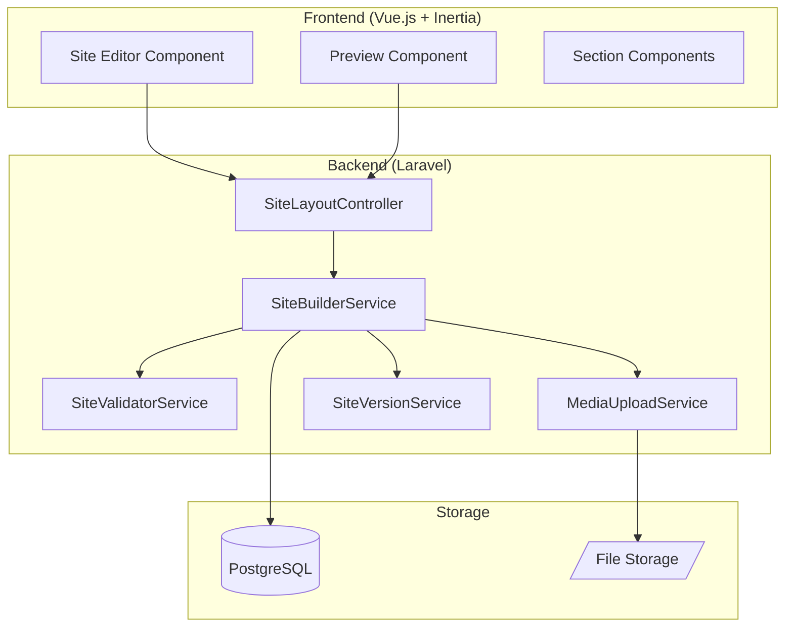
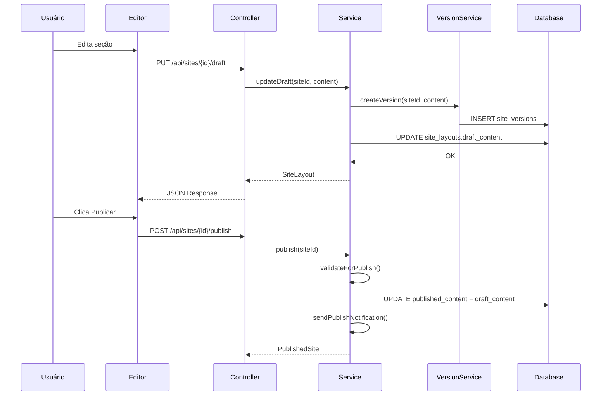

# Design Document: Wedding Site Builder

## Overview

O módulo Wedding Site Builder permite que casais criem e personalizem sites de casamento através de um editor visual. O sistema utiliza arquitetura baseada em JSON para flexibilidade, com separação clara entre rascunho e versão publicada, versionamento automático, e validações de qualidade antes da publicação.

### Princípios de Design

1. **Flexibilidade via JSON**: Estrutura de dados em JSONB permite evolução do schema sem migrations
2. **Draft-First**: Todas as alterações são rascunhos até publicação explícita
3. **Segurança por Design**: Sanitização de conteúdo, validação de uploads, isolamento por wedding
4. **Performance**: Otimização automática de imagens, lazy-loading, alertas de tamanho

## Architecture



### Fluxo de Dados



## Components and Interfaces

### Models

#### SiteLayout Model
```php
class SiteLayout extends WeddingScopedModel
{
    protected $fillable = [
        'wedding_id',
        'draft_content',
        'published_content', 
        'slug',
        'custom_domain',
        'access_token',
        'is_published',
        'published_at',
    ];
    
    protected $casts = [
        'draft_content' => 'array',
        'published_content' => 'array',
        'is_published' => 'boolean',
        'published_at' => 'datetime',
    ];
}
```

#### SiteVersion Model
```php
class SiteVersion extends Model
{
    protected $fillable = [
        'site_layout_id',
        'content',
        'user_id',
        'summary',
        'is_published',
    ];
    
    protected $casts = [
        'content' => 'array',
        'is_published' => 'boolean',
    ];
}
```

#### SiteTemplate Model
```php
class SiteTemplate extends Model
{
    protected $fillable = [
        'name',
        'description',
        'thumbnail',
        'content',
        'is_public',
        'wedding_id', // null for system templates
    ];
    
    protected $casts = [
        'content' => 'array',
        'is_public' => 'boolean',
    ];
}
```

### Services

#### SiteBuilderService
```php
interface SiteBuilderServiceInterface
{
    public function create(Wedding $wedding): SiteLayout;
    public function updateDraft(SiteLayout $site, array $content): SiteLayout;
    public function publish(SiteLayout $site): SiteLayout;
    public function rollback(SiteLayout $site, SiteVersion $version): SiteLayout;
    public function generateSlug(Wedding $wedding): string;
    public function applyTemplate(SiteLayout $site, SiteTemplate $template): SiteLayout;
}
```

#### SiteValidatorService
```php
interface SiteValidatorServiceInterface
{
    public function validateForPublish(SiteLayout $site): ValidationResult;
    public function validateSection(string $section, array $content): ValidationResult;
    public function checkAccessibility(array $content): array; // Returns warnings
    public function runQAChecklist(SiteLayout $site): QAResult;
}
```

#### MediaUploadService
```php
interface MediaUploadServiceInterface
{
    public function upload(UploadedFile $file, Wedding $wedding): MediaFile;
    public function validateFile(UploadedFile $file): ValidationResult;
    public function optimizeImage(string $path): array; // Returns optimized versions
    public function scanForMalware(string $path): bool;
    public function getStorageUsage(Wedding $wedding): int; // bytes
}
```

#### SiteVersionService
```php
interface SiteVersionServiceInterface
{
    public function createVersion(SiteLayout $site, array $content, User $user, string $summary): SiteVersion;
    public function getVersions(SiteLayout $site, int $limit = 30): Collection;
    public function restore(SiteLayout $site, SiteVersion $version): SiteLayout;
    public function pruneOldVersions(SiteLayout $site, int $maxVersions): int;
}
```

### Controllers

#### SiteLayoutController
```php
class SiteLayoutController extends Controller
{
    // GET /sites - Lista site do wedding atual
    public function index(): Response;
    
    // POST /sites - Cria novo site
    public function store(CreateSiteRequest $request): Response;
    
    // GET /sites/{site} - Detalhes do site
    public function show(SiteLayout $site): Response;
    
    // PUT /sites/{site}/draft - Atualiza rascunho
    public function updateDraft(UpdateDraftRequest $request, SiteLayout $site): Response;
    
    // POST /sites/{site}/publish - Publica site
    public function publish(SiteLayout $site): Response;
    
    // POST /sites/{site}/rollback - Rollback para versão
    public function rollback(RollbackRequest $request, SiteLayout $site): Response;
    
    // GET /sites/{site}/versions - Lista versões
    public function versions(SiteLayout $site): Response;
    
    // POST /sites/{site}/restore/{version} - Restaura versão
    public function restore(SiteLayout $site, SiteVersion $version): Response;
}
```

#### PublicSiteController
```php
class PublicSiteController extends Controller
{
    // GET /{slug} - Exibe site público
    public function show(string $slug): Response;
    
    // POST /{slug}/auth - Autentica com senha
    public function authenticate(AuthenticateRequest $request, string $slug): Response;
}
```

## Data Models

### Database Schema

```mermaid
erDiagram
    weddings ||--o| site_layouts : has
    site_layouts ||--o{ site_versions : has
    site_layouts ||--o{ site_media : has
    site_templates ||--o{ site_layouts : applied_to
    users ||--o{ site_versions : creates
    system_configs ||--|| system : configures
    
    site_layouts {
        uuid id PK
        uuid wedding_id FK
        jsonb draft_content
        jsonb published_content
        string slug UK
        string custom_domain
        string access_token
        boolean is_published
        timestamp published_at
        timestamps
    }
    
    site_versions {
        uuid id PK
        uuid site_layout_id FK
        uuid user_id FK
        jsonb content
        string summary
        boolean is_published
        timestamps
    }
    
    site_media {
        uuid id PK
        uuid site_layout_id FK
        uuid wedding_id FK
        string original_name
        string path
        string disk
        integer size
        string mime_type
        jsonb variants
        timestamps
    }
    
    site_templates {
        uuid id PK
        uuid wedding_id FK
        string name
        string description
        string thumbnail
        jsonb content
        boolean is_public
        timestamps
    }
    
    system_configs {
        string key PK
        jsonb value
        string description
        timestamps
    }
```

### JSON Schema: Site Content

```json
{
  "version": "1.0",
  "sections": {
    "header": {
      "enabled": true,
      "logo": { "url": "", "alt": "" },
      "title": "",
      "subtitle": "",
      "showDate": true,
      "navigation": [],
      "actionButton": { "label": "", "target": "", "style": "primary" },
      "style": {
        "height": "80px",
        "alignment": "center",
        "backgroundColor": "#ffffff",
        "sticky": false
      }
    },
    "hero": {
      "enabled": true,
      "media": { "type": "image", "url": "", "fallback": "" },
      "title": "",
      "subtitle": "",
      "ctaPrimary": { "label": "", "target": "" },
      "ctaSecondary": { "label": "", "target": "" },
      "layout": "full-bleed",
      "style": {
        "overlay": { "color": "#000000", "opacity": 0.3 },
        "textAlign": "center",
        "animation": "fade"
      }
    },
    "saveTheDate": {
      "enabled": true,
      "showMap": true,
      "mapCoordinates": { "lat": null, "lng": null },
      "description": "",
      "showCountdown": true,
      "countdownFormat": "days",
      "showCalendarButton": true,
      "style": { "backgroundColor": "#f5f5f5", "layout": "card" }
    },
    "giftRegistry": {
      "enabled": false,
      "style": { "backgroundColor": "#ffffff" }
    },
    "rsvp": {
      "enabled": false,
      "style": { "backgroundColor": "#f5f5f5" }
    },
    "photoGallery": {
      "enabled": false,
      "albums": {
        "before": { "title": "Nossa História", "photos": [] },
        "after": { "title": "O Grande Dia", "photos": [] }
      },
      "layout": "masonry",
      "allowDownload": true,
      "style": { "backgroundColor": "#ffffff" }
    },
    "footer": {
      "enabled": true,
      "socialLinks": [],
      "copyrightText": "",
      "copyrightYear": null,
      "showPrivacyPolicy": false,
      "showBackToTop": true,
      "style": {
        "backgroundColor": "#333333",
        "textColor": "#ffffff"
      }
    }
  },
  "meta": {
    "title": "",
    "description": "",
    "ogImage": "",
    "canonical": ""
  },
  "theme": {
    "primaryColor": "#d4a574",
    "secondaryColor": "#8b7355",
    "fontFamily": "Playfair Display",
    "fontSize": "16px"
  }
}
```

### System Config Keys

| Key | Type | Default | Description |
|-----|------|---------|-------------|
| `site.max_file_size` | integer | 10485760 | Tamanho máximo de arquivo em bytes (10MB) |
| `site.max_versions` | integer | 30 | Número máximo de versões por site |
| `site.max_storage_per_wedding` | integer | 524288000 | Storage máximo por wedding em bytes (500MB) |
| `site.performance_threshold` | integer | 5242880 | Limite de alerta de performance em bytes (5MB) |
| `site.google_maps_api_key` | string | null | Chave API do Google Maps |
| `site.mapbox_api_key` | string | null | Chave API do Mapbox |
| `site.allowed_extensions` | array | ["jpg","jpeg","png","gif","webp","mp4","webm"] | Extensões permitidas |
| `site.blocked_extensions` | array | ["exe","bat","sh","php","js"] | Extensões bloqueadas |
| `site.rate_limit_attempts` | integer | 5 | Tentativas antes de bloqueio |
| `site.rate_limit_minutes` | integer | 15 | Minutos de bloqueio |

## Correctness Properties

*A property is a characteristic or behavior that should hold true across all valid executions of a system—essentially, a formal statement about what the system should do. Properties serve as the bridge between human-readable specifications and machine-verifiable correctness guarantees.*

### Property 1: Controle de Acesso por Perfil

*For any* user attempting to access the Sites module, access SHALL be granted if and only if:
- User is Admin, OR
- User is Couple in the wedding, OR  
- User is Organizer with 'sites' permission in the wedding

All other users (Guests, Organizers without permission) SHALL receive 403 Forbidden.

**Validates: Requirements 1.4, 1.5**

### Property 2: Unicidade de Site por Wedding

*For any* wedding in the system, there SHALL exist at most one SiteLayout record with that wedding_id.

**Validates: Requirements 1.6**

### Property 3: Unicidade de Slug

*For any* two SiteLayout records in the system, their slug values SHALL be different (unique constraint).

**Validates: Requirements 5.2**

### Property 4: Round-trip de Publicação

*For any* SiteLayout, after calling publish(), the published_content SHALL be equal to the draft_content that existed immediately before the publish operation.

**Validates: Requirements 3.2**

### Property 5: Round-trip de Restauração de Versão

*For any* SiteLayout and any of its SiteVersions, after calling restore(version), the draft_content SHALL be equal to the version's content.

**Validates: Requirements 4.4**

### Property 6: Limite de Versões (FIFO)

*For any* SiteLayout, the count of associated SiteVersions SHALL never exceed the configured max_versions limit. When the limit is reached and a new version is created, the oldest version SHALL be removed.

**Validates: Requirements 4.2, 4.3**

### Property 7: Integridade de Versões

*For any* SiteVersion record, the fields user_id, created_at, and summary SHALL be non-null.

**Validates: Requirements 4.6**

### Property 8: Validação de Schema JSON do Site

*For any* valid SiteLayout draft_content, serializing to JSON and deserializing back SHALL produce an equivalent structure containing all required section keys (header, hero, saveTheDate, giftRegistry, rsvp, photoGallery, footer).

**Validates: Requirements 2.1, 2.3**

### Property 9: Substituição de Placeholders

*For any* Wedding with couple members and a wedding_date, rendering site content with placeholders {noivo}, {noiva}, {data}, {local}, {cidade} SHALL replace each placeholder with the corresponding wedding data. No placeholder tokens SHALL remain in the rendered output.

**Validates: Requirements 22.1-22.7, 7.4**

### Property 10: Sanitização de Scripts

*For any* input string containing `<script>` tags or inline event handlers (onclick, onerror, etc.), the sanitized output SHALL NOT contain any executable JavaScript code.

**Validates: Requirements 20.1-20.4**

### Property 11: Validação de Upload

*For any* uploaded file:
- If extension is in blocked_extensions → reject
- If extension is not in allowed_extensions → reject
- If size > max_file_size → reject
- If MIME type doesn't match extension → reject
- Otherwise → accept

**Validates: Requirements 16.1-16.5**

### Property 12: Geração de Slug a partir de Nomes

*For any* Wedding with couple members having names, the generated slug SHALL contain normalized (lowercase, hyphenated) versions of at least one couple member's name.

**Validates: Requirements 5.1**

### Property 13: Proteção por Senha

*For any* SiteLayout with a non-null access_token, public access without providing the correct token SHALL be denied. Access with the correct token SHALL be granted.

**Validates: Requirements 5.5, 6.2**

## Error Handling

### Error Categories

| Category | HTTP Code | Handling |
|----------|-----------|----------|
| Unauthorized | 401 | Redirect to login |
| Forbidden | 403 | Show permission denied message |
| Not Found | 404 | Show 404 page |
| Validation Error | 422 | Return field-specific errors |
| Rate Limited | 429 | Show retry-after message |
| Server Error | 500 | Log error, show generic message |

### Specific Error Scenarios

1. **Upload Validation Failures**
   - Invalid extension: "Tipo de arquivo não permitido. Use: jpg, png, gif, webp, mp4"
   - File too large: "Arquivo excede o limite de {max_size}MB"
   - Storage quota exceeded: "Limite de armazenamento atingido para este casamento"
   - Malware detected: "Arquivo rejeitado por motivos de segurança"

2. **Publication Validation Failures**
   - Missing required fields: Lista de campos por seção
   - Invalid URLs: Lista de URLs inválidas
   - Missing alt text: Lista de imagens sem alt
   - WCAG contrast issues: Lista de problemas de contraste

3. **Access Control Failures**
   - Wrong password: "Senha incorreta" (sem revelar se site existe)
   - Rate limited: "Muitas tentativas. Tente novamente em {minutes} minutos"

## Testing Strategy

### Unit Tests

- SiteBuilderService: create, updateDraft, publish, rollback
- SiteValidatorService: validateForPublish, validateSection, checkAccessibility
- MediaUploadService: validateFile, optimizeImage
- SiteVersionService: createVersion, pruneOldVersions, restore
- PlaceholderService: replacePlaceholders
- SlugGeneratorService: generateSlug, ensureUnique
- ContentSanitizerService: sanitize

### Property-Based Tests

Cada propriedade definida na seção Correctness Properties será implementada como um teste property-based usando Pest PHP com o plugin `pestphp/pest-plugin-faker` para geração de dados.

**Configuração**: Mínimo 100 iterações por teste.

**Biblioteca**: Pest PHP com generators customizados.

| Property | Test File | Generator |
|----------|-----------|-----------|
| P1: Access Control | `SiteAccessControlPropertyTest.php` | UserGenerator, WeddingGenerator |
| P2: Site Uniqueness | `SiteUniquenessPropertyTest.php` | WeddingGenerator |
| P3: Slug Uniqueness | `SlugUniquenessPropertyTest.php` | SiteLayoutGenerator |
| P4: Publish Round-trip | `PublishRoundTripPropertyTest.php` | SiteContentGenerator |
| P5: Restore Round-trip | `RestoreRoundTripPropertyTest.php` | SiteVersionGenerator |
| P6: Version Limit | `VersionLimitPropertyTest.php` | SiteLayoutGenerator |
| P7: Version Integrity | `VersionIntegrityPropertyTest.php` | SiteVersionGenerator |
| P8: JSON Schema | `JsonSchemaPropertyTest.php` | SiteContentGenerator |
| P9: Placeholder Substitution | `PlaceholderPropertyTest.php` | WeddingGenerator, ContentGenerator |
| P10: Script Sanitization | `SanitizationPropertyTest.php` | MaliciousContentGenerator |
| P11: Upload Validation | `UploadValidationPropertyTest.php` | FileGenerator |
| P12: Slug Generation | `SlugGenerationPropertyTest.php` | WeddingGenerator |
| P13: Password Protection | `PasswordProtectionPropertyTest.php` | SiteLayoutGenerator |

### Integration Tests

- Fluxo completo: criar site → editar → publicar → acessar público
- Upload de mídia com otimização
- Versionamento com limite e pruning
- Rollback após publicação
- Acesso com senha

### E2E Tests (Cypress/Playwright)

- Editor visual: navegação entre seções
- Preview responsivo: breakpoints
- Publicação com validação
- Acesso público com/sem senha
